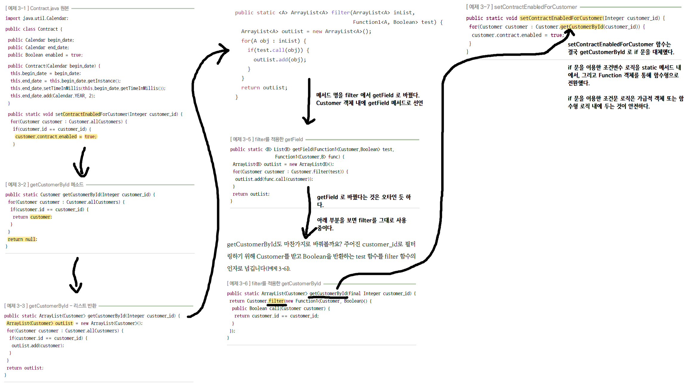

# 3.1. 순수함수 - 입력에 따라 출력이 달라진다

예제에서 Calendar 클래스를 사용하고 있는데, 이 Calendar 클래스는 내 의도와는 무관하게 책의 예제가 사용한 클래스다. 요약하는 입장이라 내용을 수정해서 정리하면 모호해질 수 있기에 원문 그대로 가져왔다.<br>

이번 장에서 주로 다루는 내용은 이렇다.

- 하나의 기능에 대해서 여러개의 순수함수로 기능을 분리해 나간다.

<br>

그 과정에서 아래의 변경사항을 적용해나간다.

- foor loop 을 Customer 클래스 내의 별도 메서드에 분리
- null 값 대신 리스트를 반환하고, 값이 비어있을 때는 빈 리스트를 반환하도록 정의
- if \~else 구문을 별도의 Function1에 담아서 전달할 수 있도록 분리했다.
- filter 함수를 만들었는데, 이 filter 함수는 고객아이디인지 체크하는 if ~ else 를 Function 으로 받아서 새로운 리스트를 반환하는 함수다.(Stream 의 filter 와는 용도가 조금 다르다.)
  - 이 책에서의 filter 메서드는 특정 Predicate에 해당하는 새로운 리스트를 반환하는 역할을 한다.

<br>

대체적으로 3\.2, 3\.3 에 비해 어려운 내용은 없고, if\~else , for 루프를 분리해나가는 하나의 예제를 엿볼 수 있다. 실무에서 아래 코드들이 즉시 어제든 아이디어로 떠올르길 !! <br>

<br>


### 참고자료

- [함수형 길들이기 - 코드의 재사용과 높은 수준의 테스팅을 원한다면](http://www.yes24.com/Product/Goods/17945487)

<br>


### 변경 전

#### Contract.java

```java
package io.gosgjung.study.fpstudy.ch3_pure_function.ch3_1_input_driven_output.before;

import java.util.Calendar;

public class Contract {
    public Calendar begin_date;
    public Calendar end_date;
    public Boolean enabled = true;

    public Contract(Calendar begin_date) {
        this.begin_date = begin_date;
        this.end_date = this.begin_date.getInstance();
        this.end_date.setTimeInMillis(this.begin_date.getTimeInMillis());
        this.end_date.add(Calendar.YEAR, 2);
    }

    public Contract setBeginDate(Calendar begin_date) {
        this.begin_date = begin_date;
        return this;
    }

    public Contract setEndDate(Calendar end_date) {
        this.end_date = end_date;
        return this;
    }

    public Contract setEnabled(Boolean enabled) {
        this.enabled = enabled;
        return this;
    }

    public static void setContractEnabledForCustomer(Integer customer_id) {
        for(Customer customer : Customer.allCustomers) {
            if(customer.id == customer_id) {
                customer.contract.enabled = true;
            }
        }
    }
}
```

<br>


#### Customer.java

```java
public class Customer {

    static public ArrayList<Customer> allCustomers = new ArrayList<Customer>();
    public Integer id = 0;
    public Boolean enabled = true;
    public Contract contract;

    public static Customer getCustomerById(Integer customer_id){
        for(Customer customer : Customer.allCustomers){
            if(customer.id == customer_id){
                return customer;
            }
        }
        return null;
    }

}
```

<br>


### 변경 후

#### 새로운 요구사항 - '계약'기능의 추가요청

현재 계약 기능에는 해지 기능만 있고 계약 기능은 없다. 그래서 계약 기능을 구현해달라는 새로운 요구사항이 발생했다.<br>

```java
public class Contract{
    
    // ...
    
    public static void setContractEnabledForCustomer(Integer customer_id){
        for(Customer customer: Customer.allCustomers){
            customer.contract.enabled = true;
        }
    }
    
}
```

<br>

#### for loop 을 Customer 클래스 내의 별도의 메서드로 분리

그런데 loop 가 나타났다. for loop 과 같은 루프 구문 종류의 기능은 따로 빼내는게 좋다.(2장 참고)<br>

for 루프를 따로 빼내기 위해 우선 Customer 클래스 내에 메서드를 따로 만들었다. 

```java
public class Customer{
    static public ArrayList<Customer> allCustomers = new ArrayList<Customer>();

    public static Customer getCustomerById(Integer customer_id){
        for(Customer customer : Customer.allCustomers){
            if(customer.id == customer_id){
                return customer;
            }
        }
        return null;
    }
}
```

<br>


#### null 값의 발생

그런데 null 값이 생겼다. 위의 Customer 클래스의 getCustomerById() 메서드를 보면 null 값을 리턴하고 있다.

**getCustomerById**  를 호출한 쪽에서 null 을 리턴받았다면, 어떤 의미로 받아들여야 할까? 이 경우 **굉장히 많은 코드에서 null일 경우를 일일이 체크하게 될 수도** 있다. 또한 **악명높은 NullPointerException 오류 때문에 런타임 에러가 생기지 않게 하기 위해 수없이 많은 조건문을 추가**하게 될 수도 있다.

<br>


#### 리스트 값을 반환, 값이 없으면 빈 리스트로 반환하도록.

예외를 던지는 것도 하나의 방법이 될 수 있다. 하지만, getCustomerById() 는 프로그램 오류가 아닌데도 고객을 못찾았다는 이유로 예외를 던지고 있다.<br>

이 경우 Optional 을 반환하도록 할수도 있고, List 타입을 반환하게 할 수도 있다. 책에서는 List 타입에 값을 채워서 리턴하는 것을 권장하고 있다.<br>

```java
public class Customer{
    // ...
    
    public static ArrayList<Customer> getCustomerById(Integer customer_id){
        ArrayList<Customer> outList = new ArrayList<Customer>();
        for(Customer customer : Customer.allCustomers){
            if(customer.id == customer_id){
                outList.add(customer);
            }
        }
        return outList;
    }
    
    // ...
}
```

<br>


#### if ~ else 구문을 분리

위의 getCustomerById(int) 메서드는 2장에서 공부했듯이 2장의 getField 메서드 처럼 고객을 필터링 하거나 모두 발견하는 기능의 구문을 가지고 있다.<br>

if 구문을 따로 filter() 라는 이름의 함수로 분리하자.<br>

```java
public class Customer{
    
    // ...
    
    public static ArrayList<Customer> filter(Function1<Customer, Boolean> test){
        ArrayList<Customer> outList = new ArrayList<>();
        for(Customer customer: Customer.allCustomers){
            if(test.call(customer)){
                outList.add(customer);
            }
        }
        return outList;
    }
    
    // ...
}
```

<br>


그리고 이렇게 분리한 filter(Function1) 메서드는 getField(Function1, Function1) 메서드에서 사용하도록 변경했다. (하지만, 실제 예제코드를 작성해보면, 아래에 작성한 getField 함수는 최종적으로 사용되지 않는것을 확인할 수 있다. 아마도 저자인 조슈아 백필드의 실수가 있었던 듯 싶다. )

```java
public class Customer{
    // ...
    
    public static <B> List<B> getField(
        Function1<Customer, Boolean> test,
        Function1<Customer, B> func
    ){
        ArrayList<B> outList = new ArrayList<>();
        for(Customer customer: Customer.filter(test)){
            outList.add(func.call(customer));
        }
        return outList;
    }
    
    // ... 
}
```

<br>


#### 변경한 구조에 맞춰서 상위호출단의 코드도 변경 (getCustomerById(int))

다시 한번 정리하지만, 변경 전의 getCustomerById(int) 메서드는 아래와 같다.

```java
public class Customer{
    
    // ... 
    
    public static ArrayList<Customer> getCustomerById(Integer customer_id){
        ArrayList<Customer> outList = new ArrayList<Customer>();
        for(Customer customer : Customer.allCustomers){
            if(customer.id == customer_id){
                outList.add(customer);
            }
        }
        return outList;
    }
    
    // ...

}
```

<br>


위의 코드를 for loop, if ~ else 구문 분리, null 값 반환 구문을 리스트를 반환하도록 변경하도록 수정한 변경 후의 코드는 아래와 같다.<br>

```java
public class Customer{
    
    // ...
    
    public static ArrayList<Customer> getCustomerById(Integer customer_id){
        return Customer.filter(new Function1<Customer, Boolean>(){
            @Override
            public Boolean call(Customer customer) {
                return customer.id == customer_id;
            }
        });
    }
    
    // ...
    
}
```


#### 변경한 구조에 맞춰서 상위 호출단의 코드도 변경 (setContractEnabledForCustomer(int))

변경 전의 setContractEnabledForCustomer(int) 메서드는 아래와 같다.

```java
public class Contract{
    // ...
    
    public static void setContractEnabledForCustomer(Integer customer_id) {
        for(Customer customer : Customer.allCustomers) {
            if(customer.id == customer_id) {
                customer.contract.enabled = true;
            }
        }
    }
    
    // ...
    
}
```


이제 변경 후의 getCustomerId를 적용한 setContractForCustomer(int) 메서는 아래와 같다. if 문을 for문을 통해서 체크하는 로직들이 Customer 객체 내로 옮겨졌다.

```java
public class Contract{
    
    public static void setContractEnabledForCustomer(Integer customer_id) {
        for(Customer customer : Customer.getCustomerById(customer_id)) {
            customer.contract.enabled = true;
        }
    }
    
    // ... 
    
}
```


#### 변경된 전체 코드

##### Contract

```java
public class Contract {
    public Calendar begin_date;
    public Calendar end_date;
    public Boolean enabled = true;

    public Contract(Calendar begin_date) {
        this.begin_date = begin_date;
        this.end_date = this.begin_date.getInstance();
        this.end_date.setTimeInMillis(this.begin_date.getTimeInMillis());
        this.end_date.add(Calendar.YEAR, 2);
    }

    public static void setContractEnabledForCustomer(Integer customer_id) {
        for(Customer customer : Customer.getCustomerById(customer_id)) {
            customer.contract.enabled = true;
        }
    }

}

```

<br>


##### Customer

```java
public class Customer {

    static public ArrayList<Customer> allCustomers = new ArrayList<Customer>();
    public Integer id = 0;
    public Boolean enabled = true;
    public Contract contract;

    public static ArrayList<Customer> getCustomerById(Integer customer_id){
        return Customer.filter(new Function1<Customer, Boolean>(){
            @Override
            public Boolean call(Customer customer) {
                return customer.id == customer_id;
            }
        });
    }
    
    public static ArrayList<Customer> filter(Function1<Customer, Boolean> test){
        ArrayList<Customer> outList = new ArrayList<>();
        for(Customer customer: Customer.allCustomers){
            if(test.call(customer)){
                outList.add(customer);
            }
        }
        return outList;
    }

    // 저자가 설명은 했지만, 3장에서는 사용되지 않는 코드. 
    // 중간에 아이디어가 바뀌었겠지 싶었었다.
    public static <B> List<B> getField(
            Function1<Customer, Boolean> test,
            Function1<Customer, B> func
    ){
        ArrayList<B> outList = new ArrayList<>();
        for(Customer customer: Customer.filter(test)){
            outList.add(func.call(customer));
        }
        return outList;
    }
}

```


