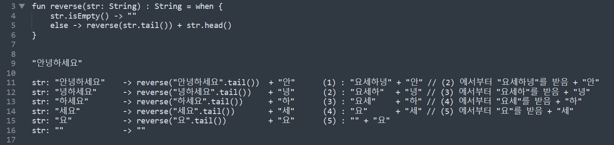
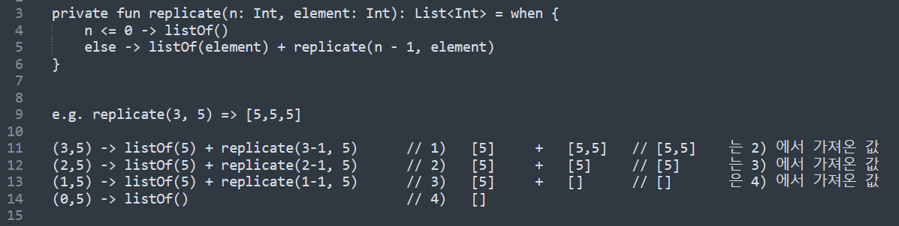

# 갑분재귀 연습 (1)

어떤 책이든 함수형 프로그래밍을 공부하다보면 꼬리재귀라는 개념이 나오고 그 전에 앞서서 재귀 개념이 나오는 것 같다.<br>

재귀가 어떻게 왜 안좋은지를 보고 이것을 꼬리재귀로 해결하면 어떤 점이 좋은지를 설명한다.

[함수형 길들이기 - 코드의 재사용과 높은 수준의 테스팅을 원한다면](http://www.yes24.com/Product/Goods/17945487) 에서 설명하는 예제가 너무 부실해서 

[코틀린으로 배우는 함수형 프로그래밍](http://www.yes24.com/Product/Goods/84899008) 의 재귀, 꼬리 재귀 챕터의 연습문제들과 설명들을 보고 연습한 내용들을 정리해봤다.<br>

<br>

갑자기 진도가 막혀서 억울하긴 했는데, 이럴 수록 나의 투지는 살아나지.<br>

<br>

# 참고자료

- [함수형 길들이기 - 코드의 재사용과 높은 수준의 테스팅을 원한다면](http://www.yes24.com/Product/Goods/17945487)
- [코틀린으로 배우는 함수형 프로그래밍](http://www.yes24.com/Product/Goods/84899008)

<br>


# 문자열 뒤집기 (reverse)

가장 쉬운 예제.<br>

입력으로 들어온 리스트의 값을 뒤집는 재귀 함수를 만들어보자.<br>

`ch3_3_recursions.kt`

```kotlin
package io.gosgjung.study.fpstudy.fp_from_kotlin.ch3_recursion

fun String.head() = first()     // first() : 맨 앞의 문자를 리턴
fun String.tail() = drop(1)  // drop() : 맨 앞에서 n 번째 요소까지를 remove 한 문자열을 리턴


// 코틀린으로 배우는 함수형 프로그래밍 67p

fun main(args: Array<String>){
    println("안녕하세요".head()) // 안
    println("안녕하세요".tail()) // 녕하세요
    println("test = ${"요".tail()}")

    println(reverse("안녕하세요"))
}

fun reverse(str: String) : String = when {
    str.isEmpty() -> ""
    else -> reverse(str.tail()) + str.head()
}

```

<br>

출력결과

```plain
안
녕하세요
test = 
요세하녕안
```

<br>

설명

- 설명은 그림으로 대체하기로 했다.
- 시간이 많지 않아서 ㅠㅠ




# 연습문제 3.4

10진수 숫자를 입력받아서 2진수 문자열로 반환하는 함수를 작성하라

`3-4-toBinary.kt`

```kotlin
package io.gosgjung.study.fpstudy.fp_from_kotlin.ch3_recursion.exercise.solution

fun main(){
    println(toBinary(10))
    println(toBinary(27))
    println(toBinary(255))
}

private tailrec fun toBinary(n: Int, acc: String = ""): String = when {
    n < 2 -> n.toString() + acc
    else -> {
        val binary = (n % 2).toString() + acc
        toBinary(n / 2, binary)
    }
}
```

<br>

출력결과

```plain
1010
11011
11111111
```

<br>

설명

- 이것 역시 시간이 많지 않아서 일단은 스킵하고, 간단한 설명만 정리

10진수 숫자에 대해서 2진수를 도출해낼 때 그 숫자를 더 이상 나눌 수 없을 때(1 또는 0일때까지) 까지 나눈 후에 

- 가장 마지막의 몫 -> 나머지(n-1) -> 나머지 (n-2) .... 

을 반복해나간다.

즉, 맨 뒤까지 간 다음에 위로 거슬러 올라가야 한다.

그리고 숫자로 연산하는 것이 아니라 문자열을 prepend 해나간다는 점에 착안해서 풀어야 한다.<br>

<br>


# 연습문제 3.5

숫자를 두개 입력 받은 후 두 번째 숫자를 첫 번째 숫자만큼 가지고 있는

리스트를 반환하는 함수를 만들어보자.

예를 들어 replicate(3,5) 를 입력하면 5가 3개 있는 리스트 [5,5,5]를 반환한다.

`3-5-replicate.kt`

```kotlin
fun main() {
    println(replicate(3, 5))    // [5, 5, 5]
    println(replicate(5, 1))    // [1, 1, 1, 1, 1]
}

private fun replicate(n: Int, element: Int): List<Int> = when {
    n <= 0 -> listOf()
    else -> listOf(element) + replicate(n - 1, element)
}
```

<br>

출력결과

```plain
[5, 5, 5]
[1, 1, 1, 1, 1]
```

<br>


설명

- 자세한 설명은 지금 당장은 시간이 많지 않아 스킵.

그림으로 남겨둔 것을 첨부함.



<br>


# take

입력 리스트에서 입력받은 숫자 만큼의 값을 꺼내오는 take 함수를 만들어보자.

head(), tail() 함수는 소스코드 내의 1), 2) 에서 별도로 정의한 확장함수다.

```kotlin
fun <T> List<T>.head() = first()	// 1)
fun <T> List<T>.tail() = drop(1)	// 2)

fun main(args: Array<String>){
    println(take(3, listOf(1,2,3,4,5)))
}

fun take(n: Int, list: List<Int>): List<Int> = when {
    n <= 0 -> listOf()
    list.isEmpty() -> listOf()
    else -> listOf(list.head()) + take(n - 1, list.tail())
}
```

<br>


