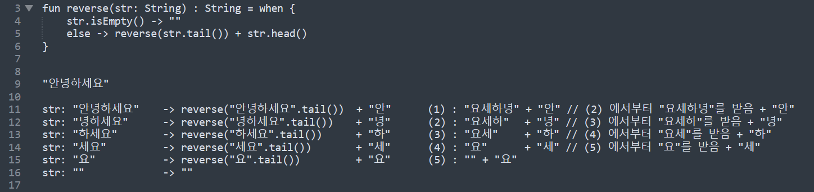

# 재귀,꼬리재귀,트램펄린

함수형 프로그래밍을 제대로 처음부터 공부하는 중인데, 재귀, 꼬리재귀, 트램펄린 개념이 나왔다.

[함수형 길들이기 - 코드의 재사용과 높은 수준의 테스팅을 원한다면](http://www.yes24.com/Product/Goods/17945487) 에서 설명하는 예제가 너무 부실해서 

[코틀린으로 배우는 함수형 프로그래밍](http://www.yes24.com/Product/Goods/84899008) 의 재귀, 꼬리 재귀 챕터의 연습문제들과 설명들을 보고 연습한 내용들을 정리해봤다.<br>

<br>

갑자기 진도가 막혀서 억울하긴 한데, 이럴 수록 나의 투지는 살아나지.<br>

<br>


# 참고자료

- [함수형 길들이기 - 코드의 재사용과 높은 수준의 테스팅을 원한다면](http://www.yes24.com/Product/Goods/17945487)
- [코틀린으로 배우는 함수형 프로그래밍](http://www.yes24.com/Product/Goods/84899008)
- [Java 8 으로 꼬리재귀 함수 만들기 (Tail Recursion)](https://loosie.tistory.com/790)

<br>


# 문자열 뒤집기 (reverse)

가장 쉬운 예제.<br>

입력으로 들어온 리스트의 값을 뒤집는 재귀 함수를 만들어보자.<br>

`ch3_3_recursions.kt`

```kotlin
package io.gosgjung.study.fpstudy.fp_from_kotlin.ch3_recursion

fun String.head() = first()     // first() : 맨 앞의 문자를 리턴
fun String.tail() = drop(1)  // drop() : 맨 앞에서 n 번째 요소까지를 remove 한 문자열을 리턴


// 코틀린으로 배우는 함수형 프로그래밍 67p

fun main(args: Array<String>){
    println("안녕하세요".head()) // 안
    println("안녕하세요".tail()) // 녕하세요
    println("test = ${"요".tail()}")

    println(reverse("안녕하세요"))
}

fun reverse(str: String) : String = when {
    str.isEmpty() -> ""
    else -> reverse(str.tail()) + str.head()
}

```

<br>

출력결과

```plain
안
녕하세요
test = 
요세하녕안
```

<br>

설명

- 설명은 그림으로 대체하기로 했다.
- 시간이 많지 않아서 ㅠㅠ




# 연습문제 3.4

10진수 숫자를 입력받아서 2진수 문자열로 반환하는 함수를 작성하라

`3-4-toBinary.kt`

```kotlin
package io.gosgjung.study.fpstudy.fp_from_kotlin.ch3_recursion.exercise.solution

fun main(){
    println(toBinary(10))
    println(toBinary(27))
    println(toBinary(255))
}

private tailrec fun toBinary(n: Int, acc: String = ""): String = when {
    n < 2 -> n.toString() + acc
    else -> {
        val binary = (n % 2).toString() + acc
        toBinary(n / 2, binary)
    }
}
```

<br>

출력결과

```plain
1010
11011
11111111
```

<br>

설명

- 이것 역시 시간이 많지 않아서 일단은 스킵하고, 간단한 설명만 정리

10진수 숫자에 대해서 2진수를 도출해낼 때 그 숫자를 더 이상 나눌 수 없을 때(1 또는 0일때까지) 까지 나눈 후에 

- 가장 마지막의 몫 -> 나머지(n-1) -> 나머지 (n-2) .... 

을 반복해나간다.

즉, 맨 뒤까지 간 다음에 위로 거슬러 올라가야 한다.

그리고 숫자로 연산하는 것이 아니라 문자열을 prepend 해나간다는 점에 착안해서 풀어야 한다.<br>

<br>


# 연습문제 3.5

숫자를 두개 입력 받은 후 두 번째 숫자를 첫 번째 숫자만큼 가지고 있는

리스트를 반환하는 함수를 만들어보자.

예를 들어 replicate(3,5) 를 입력하면 5가 3개 있는 리스트 [5,5,5]를 반환한다.

`3-5-replicate.kt`

```kotlin
fun main() {
    println(replicate(3, 5))    // [5, 5, 5]
    println(replicate(5, 1))    // [1, 1, 1, 1, 1]
}

private fun replicate(n: Int, element: Int): List<Int> = when {
    n <= 0 -> listOf()
    else -> listOf(element) + replicate(n - 1, element)
}
```

<br>

출력결과

```plain
[5, 5, 5]
[1, 1, 1, 1, 1]
```

<br>


설명

- 자세한 설명은 지금 당장은 시간이 많지 않아 스킵.

그림으로 남겨둔 것을 첨부함.


<br>


# take() 함수 만들어보기

입력 리스트에서 입력받은 숫자 만큼의 값을 꺼내오는 take 함수를 만들어보자.

head(), tail() 함수는 소스코드 내의 1), 2) 에서 별도로 정의한 확장함수다.

```kotlin
fun <T> List<T>.head() = first()	// 1)
fun <T> List<T>.tail() = drop(1)	// 2)

fun main(args: Array<String>){
    println(take(3, listOf(1,2,3,4,5)))
}

fun take(n: Int, list: List<Int>): List<Int> = when {
    n <= 0 -> listOf()
    list.isEmpty() -> listOf()
    else -> listOf(list.head()) + take(n - 1, list.tail())
}
```

<br>

출력결과

```plain
[1, 2, 3]
```

<br>


설명

- 그림으로 대체


<br>


# 연습문제 3.6 - isExists()


# repeat() 함수 만들어보기


# zip() 함수 만들어보기


# 연습문제 3.8 - 퀵정렬


# 연습문제 3.9 - 최대공약수


# 메모이제이션

이미 알고 있는 개념이지만, 한번 의미를 정리해보면 아래와 같다.

- 메모이제이션(memoization)이란, 어떤 반복된 연산을 수행할 때 이전에 계산했던 값을 캐싱해서 중복된 연산을 제거하는 방법이다.

<br>


## 피보나치

### 메모이제이션 없이 피보나치를 구현할 경우

```kotlin
fun main(args: Array<String>){
    fibo(6)
}

fun fibo(n: Int) : Int {
    println("fibo(${n})")
    return when (n){
        0 -> 0
        1 -> 1
        else -> fibo(n-1) + fibo(n-2)
    }
}
```

<br>

출력결과

```plain
fibo(6)
fibo(5)
fibo(4)
fibo(3)
fibo(2)
fibo(1)
fibo(0)
fibo(1)
fibo(2)
fibo(1)
fibo(0)
fibo(3)
fibo(2)
fibo(1)
fibo(0)
fibo(1)
fibo(4)
fibo(3)
fibo(2)
fibo(1)
fibo(0)
fibo(1)
fibo(2)
fibo(1)
fibo(0)
```

<br>

25번 호출 됐다. 더 큰 값 테스트 할 때마다 기하 급수적으로 많은 횟수로 호출하게 된다.

함수 내부에서 자기 자신을 두번 호출한다. 따라서 단계를 거듭할 때 마다 호출 갯수는 두 배씩 늘어난다.

시간 복잡도는 2^N 이다.<br>

또한 이전에 했던 연산 결과를 저장하지 않았으므로 같은 연산을 여러 번 호출한다.<br>

<br>

### 메모이제이션 기반 피보나치 수열


```kotlin
package io.gosgjung.study.fpstudy.fp_from_kotlin.ch3_recursion

var memo = Array(100) { -1 }

fun main(args: Array<String>){
    println(fibo_memo(6))
}

fun fibo_memo(n: Int): Int = when {
    n == 0 -> 0
    n == 1 -> 1
    memo[n] != -1 -> memo[n]
    else -> {
        println("fibo_memo(${n})")
        memo[n] = fibo_memo(n-1) + fibo_memo(n-2)
        memo[n]
    }
}
```


출력결과

메모이제이션을 사용하면 단 5번만을 호출한다. 

나머지는 저장해둔 값을 활용한다.

```plain
fibo_memo(6)
fibo_memo(5)
fibo_memo(4)
fibo_memo(3)
fibo_memo(2)
8
```

<br>


# 꼬리재귀

**코틀린의 꼬리재귀**<br>

코틀린에서는 기본적으로 꼬리재귀를 지원한다.<br>

참고로 자바에서는 꼬리재귀가 지원되지 않는다. 다만 꼬리재귀가 되게끔 할 수는 있다. <br>

<br>


**꼬리재귀 조건에 맞지 않을 경우**<br>

꼬리재귀를 잘못 작성해 꼬리재귀 조건에 맞지 않을 경우의 이야기.<br>

꼬리재귀는 꼬리재귀 형식으로 작성한 함수의`fun` 앞에 `tailrec` 이라는 키워드를 붙이면 꼬리재귀로 사용된다. 만약 tailrec 으로 선언한 함수가 꼬리 재귀 조건에 맞지 않을 경우 IDE 에서는 Warning 메시지를 내보내고 컴파일러 최적화를 수행하지 않는다.<br>

<br>

**꼬리 재귀 최적화란?**<br>

일반적인 재귀는 호출이 반복되면서 깊이가 깊어지면 스택 오버플로우(Stack Overflow)가 발생한다.<br>

하지만 꼬리 재귀의 경우 스택 오버 플로우(Stack Overflow)문제를 일으키는 스택 프레임(stack frame)을 컴파일러가 재사용한다.<br>

꼬리호출 방식으로 재귀를 구현하면, 재귀의 마지막 결과가 재귀 호출의 전체의 결과와 일치한다. 이 때 컴파일러는 재귀의 마지막 결과가 재귀호출의 전체 결과와 같다면, 현재 스택 프레임에서 함수의 시작 지점으로 점프해서 재귀호출을 할 수 있다. 이 경우 재귀를 사용했지만 반복문(for, while)을 사용한 것 처럼 최적화할 수 있다.<br>

이렇게 꼬리 재귀 조건에 부합하는 코드라는 것을 컴파일러가 인지해서 최적화 하는 것을 꼬리 재귀 최적화라 한다.  꼬리 재귀 최적화가 일어나면 메모이제이션 같은 방법을 사용하지 않고도 성능을 향상시키고, 스택 오버 프로를 방지할 수 있다.<br>

확실히 메모이제이션은 효과적이다. 하지만, 순수한 함수로 사용할 수 없다. 외부의 데이터를 수정하기에 부수효과를 만들어낸다. 순수 함수는 부수효과가 없어야 한다. 예를 들어 위에서 살펴본 피보나치를 메모이제이션으로 구현한 것 역시 재귀 함수 내에서 값을 수정하기에 불변성을 지키지 못했다.<br>

<br>

만약 이렇게 꼬리 재귀 최적화를 하지 않으면 일반 재귀 처럼 새로운 스택 프레임을 생성을 거듭하면서, 처음 재귀를 호출한 곳으로 이동하게 된다. 스택 프레임을 무수히 많이 사용하다보면, 사용할 수 있는 스텍프레임의 갯수의 한계에 도달하게 되고 스택 오버 플로우가 발생하게 된다.<br>

<br>

**꼬리재귀를 구할때 핵심 아이디어**<br>

개인적으로 생각하기에 꼬리재귀를 구할 때 핵심 아이디어는 accumulation 인것 같다. 값을 누적해나가는 방식으로 구현해나가는 식으로 식을 작성하다보면 꼬리재귀로 처리가 가능한 구조로 바뀌는 것 같다.<br>

<br>


## reverse 함수를 꼬리재귀로 구현

```kotlin
fun String.head() = first()     // first() : 맨 앞의 문자를 리턴
fun String.tail() = drop(1)     // drop() : 맨 앞에서 n 번째 요소까지를 remove 한 문자열을 리턴

fun reverse1(str: String): String = when{
    str.isEmpty() -> ""
    else -> reverse1(str.tail()) + str.head()
}

tailrec fun reverse2(str: String, acc: String = ""): String = when{
    str.isEmpty() -> acc
    else -> {
        val reversed = str.head() + acc
        reverse2(str.tail(), reversed)
    }
}

fun main(args: Array<String>){
    println(reverse2("안녕하세요"))
}
```

<br>

출력결과

```plain
요세하녕안
```


## take 함수를 꼬리 재귀로 구현

```kotlin
fun <T> List<T>.head() = first()
fun <T> List<T>.tail() = drop(1)

tailrec fun take(n: Int, list: List<Int>, acc: List<Int> = listOf())
: List<Int> = when {
    0 >= n -> acc
    list.isEmpty() -> acc
    else -> {
        val takeList = acc + listOf(list.head())
        take(n-1, list.tail(), takeList)
    }
}

fun main(args: Array<String>){
    println(take(3, listOf(5,5,5,5,5)))
}
```


출력결과

```plain
[5, 5, 5]
```

<br>


# 트램펄린

상호 재귀를 최적화할 때 트램펄린을 사용한다.


## 상호재귀

상호 재귀(mutual recursion)는 함수 A가 함수 B를 호출하고 함수 B가 다시 함수 A를 호출하는 것을 의미한다.

예를 들어 아래의 코드를 보자

아래 코드는 `java.lang.StackOverflowError` 가 발생한다.

```kotlin
fun main(args: Array<String>){
    println(even(9999))		// "false" 출력
    println(odd(9999))		// "true"  출력
    println(9999999)		// java.lang.StackOverflowError 발생
}

fun even(n: Int):Boolean = when(n){
    0 -> true
    else -> odd(n-1)
}

fun odd(n: Int):Boolean = when(n){
    0 -> false
    else -> even(n-1)
}
```

even() 함수는 odd 함수를 호출하고 있다.

odd() 함수는 또 even 함수를 호출하고 있다.

두 함수 even(), odd() 의 종료 조건 중 한가지에 만족되면 재귀 호출은 종료되고 원하는 결과를 얻을 수 있다. 

이 동작 과정을 그림으로 표현하면 아래와 같다.

```plain
            call   call    call   call    
9999 -> even -> odd -> even -> ... -> odd -> false
```


스택 오버 플로우가 발생하지 않도록 하려면 상호 꼬리재귀(mutual tail recursion)구문으로 변경해야 한다.


## 상호 꼬리재귀, 트램펄린

상호 꼬리재귀를 가능하게 하려면 트램펄린(trampoline)을 사용하면 된다.

트램펄린은 tailrec (꼬리재귀)를 이용해 구현하는데 thunk 라고 하는 조건을 특정 조건에서만 다른 조건으로 변하기 전까지 무한히 실행하는 방식으로 구현한다.<br>

즉, 상호 재귀구문을 tailrec (꼬리재귀)를 사용해 상호 꼬리재귀 식으로 바꾸고, 이것을 트램펄린이라고 하는 방식을 통해 풀어낸다. 이것을 트램펄린이라고 한다.<br>

아래에 작성한 `trampoline` 함수는 코틀린 컴파일러에 의해 최적화된다.<br>

트램펄린은 반복적으로 함수를 실행하는 루프(loop)다. 이때 실행되는 함수를 thunk 라고 부른다.

thunk 는 다음에 실행될 함수를 매번 새로 생성해 반환한다.

트램펄린에서 thunk 는 한 번에 하나만 실행된다. 프로그램을 충분히 작은 thunk 로 쪼갠 후 트램펄린에서 점프하듯이 반복 실행하면 스택이 커지는 것을 막을 수 있다.<br>

아래 코드를 보면 트램펄린은 **값을 넘기는 것이 아니라 함수를 넘기는 것**임을 볼 수 있다.<br>

값이 아니라 함수를 넘기기 때문에 재귀 호출하는 시점이 아니라 실제로 값이 사용되는 시점에 값이 평가된다는 장점이 있다.

```kotlin
package io.gosgjung.study.fpstudy.fp_from_kotlin.ch3_recursion.exercise

sealed class Bounce<A>
data class Done<A>(val result: A): Bounce<A>()
data class More<A>(val thunk: () -> Bounce<A>): Bounce<A>()

tailrec fun<A> trampoline(bounce: Bounce<A>): A = when(bounce){
    is Done -> bounce.result
    is More -> trampoline(bounce.thunk())
}

fun odd(n: Int): Bounce<Boolean> = when (n){
    0 -> Done(false)    // 홀수는 0에 도달하면 조건을 불충족
    else -> More{even(n-1)}
}

fun even(n: Int): Bounce<Boolean> = when (n){
    0 -> Done(true)     // 짝수는 0에 도달하면 조건을 충족
    else -> More {odd(n-1)}
}

fun main(args: Array<String>){
    println(trampoline(even(999999)))   // false. java.lang.StackoverflowError 가 발생하지 않는다.
    println(trampoline(odd(999999)))    // true. java.lang.StackoverflowError 가 발생하지 않는다.
}

```


출력결과

```plain
false
true
```


트램펄린이 호출되는 구조

```plain
          even  odd    odd
999999 -> t -> t -> ... -> t -> false
```


# 함수형 언어에서의 트램펄린 지원

스칼라, 클로저 등의 언어에서는 언어 자체적으로 트램펄린을 위한 타입, 기능을 내장(built in)하고 있다.

하지만 코틀린은 트램펄린을 위한 재료들을 내장하고 있지 않다. 직접 트램펄린을 구현해야 한다.<br>

위의 예에서는 트램펄린을 간단한 형태의 함수로 구현했다. 하지만, 실제로는 프리모나드(free monad)를 사용해 트램펄린 자체를 하나의 타입으로 추상화해 사용하기도 한다.<br>

<br>


