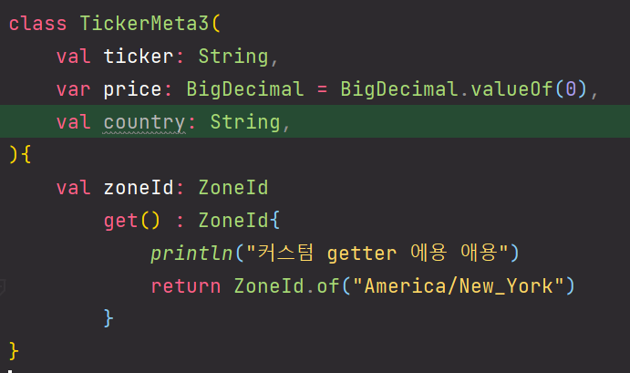

# 코틀린에서는 trailing comma 를 사용할 수  있다

코틀린에서는 클래스에 프로퍼티 선언시 trailing comma 를 사용할 수 있다. 쉽게 이야기하면 뒤따라 오는 쉼표를 의미한다. 이렇게 하는 것이 좋은 이유는, git diff 시에 수정된 라인만을 확인할 수 있어서 협업시에 조금이나마 더 장점이 있는 편이다. 

 

**trailing comma 를 사용하면...** 

예를 들어 기존 클래스의 필드 선언에 `country` 라는 필드를 추가하면 아래와 같이 line diff 시 한줄로 변경사항이 깔끔하게 표현된다.

 

java 에서는 필드를 하나 더 추가하거나 그런 상황에서는 보통 컴마를 포함해서 다음 줄까지 표시되어서 라인이 두줄로 나타난다.(자바가 나쁘다는 이야기는 아니지만, trailing comma 가 편리한 점을 조금이나마 정리해보자... 비교함)
