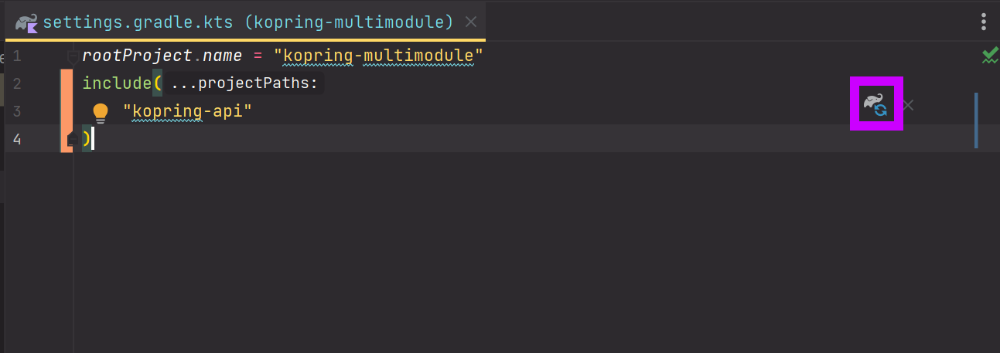

# Kotlin + Spring 멀티모듈 (1) - 단순버전

단순한 버전의 코틀린 스프링 프로젝트 멀티모듈 구성방식!!<br>

정말 정리하기 싫었다. 캡처 찍을게 많아서 정리하기 너무 싫었지만, 결국은 정리했다.<br>

일하다보면 자바를 딥하게 쓰다가 다시 코틀린을 쓸때 머리 아프고 하기 싫고 휴가쓰고 싶고 그런 순간이 오지 않을까 싶다.<br>

그때를 대비해서 그냥 정리해뒀다.<br>

예제 디렉터리는 아래와 같다.

- [study-kopring/kopring+webflux/examples/kopring-multimodule](https://github.com/gosgjung/study-kopring/tree/main/kopring%2Bwebflux/examples/kopring-multimodule)

<br>


# 참고자료

- https://www.youtube.com/watch?v=PdofVTuM-tE

- https://github.com/team-dodn/live-code-show

<br>


# 프로젝트 생성

간단하게 멀티모듈을 동작만 시킬 것이기에 `spring-boot-starter-web` 만 추가해줌<br>

<br>


<bR>


<br>


# settings.gradle.kts + 모듈 디렉터리 생성

settings.gradle.kts  내에 아래의 내용을 추가해준다.<br>

`settings.gradle.kts`

```kotlin
rootProject.name = "kopring-multimodule"
// 1) 아래의 include 함수가 새로 추가해준 부분.
include(
    "kopring-api"
)
```

<br>

프로젝트 루트 디렉터리를 오른쪽 클릭 후 > `New` > `Directory ...` 클릭


만들려는 디렉터리 명을 입력

settings.gradle.kts 에 입력했던 하위 모듈명인 `kopring-api` 를 디렉터리 명으로 입력해준다.


<br>


gradle reload 버튼 클릭



<br>


방금전 생성한 디렉터리를 인텔리제이에서 gradle 모듈로 인식한 것을 확인 가능하다.


루트 프로젝트의 `src` 디렉터리를 하위 모듈로 드래그 & 드랍 > Refactor 버튼 클릭 


# 루트 프로젝트 build.gradle.kts 내의 allprojects, subprojects 지정

내 경우는 맨날 일만 하느라 gradle을 정석적으로는 확실하게는 잘 모른다. 하지만 얕게 알고있는 것으로만 allprojects, subprojects 의 역할을 설명해보면 이렇다.

- allprojects
  - 여기에 지정되는 것은 root 프로젝트를 포함 모든 곳에 세팅된다.
- subprojects
  - 하위 모듈들에 지정된다.


루트 프로젝트의 build.gradle.kts 파일 내에서 allprojects 에 지정할 내용들은 아래와 같다.

`build.gradle.kts`

```kotlin
allprojects{
    // 1)
    group = "io.kopring.multimodule"
    version = "0.0.1-SNAPSHOT"

    // 2)
    repositories {
        mavenCentral()
    }
}
```


- `1)` 
  - group, version 에 관련된 항목들을 allprojects 내로 옮겨줬다.
- `2)`
  - repositories 항목들을 allprojectes 내로 옮겨줬다.


이번에는 subprojects 설정이다.

아래 처럼 dependencies, tasks.withType\<KotlinCompile\>, tasks.withType\<Test\> 항목들을 모두 subproejcts 내부로 옮겨줬다.

하위 모듈들에서 각각 선택해서 의존성을 추가해주면 되기에 web 의존성은 비활성화 해줬다. 


<br>


plugins 설정이다. 루트 프로젝트에는 spring 관련 플러그인을 비활성화해둘 예정이다. 스프링 플러그인은 하위 모듈들에서 각자 결정해서 사용하도록 해둘 예정이어서 이렇게 하기로 했다.


<br>


그리고 build.gradle.kts 의 `subprojects` 아래에는 아래와 같이 플러그인들을 apply 해준다.


<br>


# 루트 프로젝트 build.gradle.kts 에 대해 bootJar 비활성화, jar 패키징 활성화

루트 프로젝트의 build.gradke.kts 에 대해 bootJar 는 비활성화 하고 jar 패키징은 활성화 해준다.

build.gradle.kts 내의 `subprojects` 항목에 아래와 같이 지정해준다.


<br>


# 하위 모듈 `kopring-api` 모듈에 `build.gradle.kts` 추가

kopring-api 모듈 아래에 build.gradle.kts 추가해주자.


<br>

그리고 아래와 같이 입력해주자.

- bootJar 빌드는 활성화해줬고,
- jar 빌드는 비활성화 했다.
- dependencies 에는 spring-boot-starter-web 을 추가해줬다.


모두 입력한 후에는 gradle reload 버튼을 눌러서 모듈을 reload 한다.


<br>


# gradle reload 그리고 테스트 코드 및 Application 코드 동작 확인

gradle 을 reload 해주자.


<br>


kopring-api 라는 하위 모듈에 생성되어 있는 SpringBootApplication 을 구동시키자.


테스트 코드도 구동시켜서 잘 동작하는지 확인해본다.


