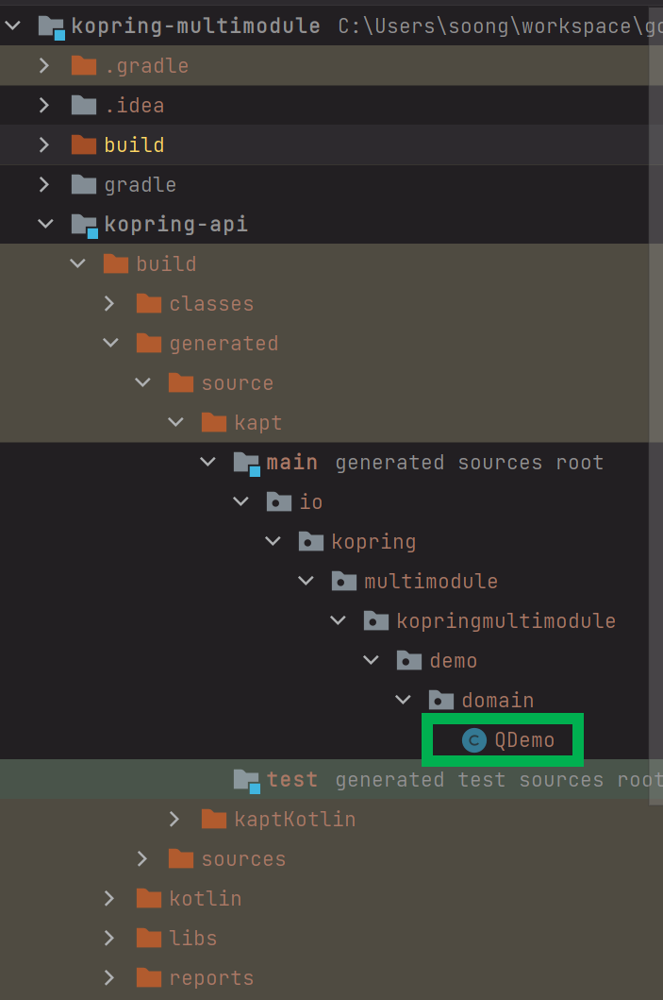

# Jpa + Querydsl 설정 (1) - 단일 모듈 지정 또는 전역 지정


jpa 는 그냥 의존성만 추가해는 작업만 했고, 어렵지 않기에 설명은 생략.  

Querydsl 설정은 조금 어렵기에 자세히 설명하기로 결정.<br>

<br>

kotlin 에서 Querydsl 을 사용하려면 kapt 라는 것을 설치해줘야 한다.

kapt 가 뭔지 모른다면, 코틀린에서 사용하는 어노테이션 프로세서 라는 정도로만 알고 있어도 될 듯 하다.<br>

Querydsl 을 설정할 때에는 아래의 절차를 따른다.

- kapt 플러그인 선언 및 apply 선언
- kapt 함수 실행
  - 이때 인자값으로 `org.springframework.boot:spring-boot-configuration-processor` 라는 문자열을 넘겨주면 된다.
  - 무슨이야기인지는 뒤에 예제를 보면 이해가 잘 된다.
- querydsl implementation 추가
- kapt querydsl 추가


# 참고자료

- https://dev-gorany.tistory.com/362

<br>


# 예제 링크

- querydsl 을 적용하면서 변경된 설정 상의 변경내역 확인은 [여기](https://github.com/gosgjung/study-kopring/commit/c844fb9a5cdd446a26c50a9c1ce51258aec6496f)서 할 수 있다.
- 예제 디렉터리는 [여기](https://github.com/gosgjung/study-kopring/tree/main/kopring%2Bwebflux/examples/kopring-multimodule)에 있다.

<br>


# 1\) 단일 모듈 지정

하위 모듈 하나에만 querydsl 을 적용하는 경우다.

## 루트모듈에 kapt 플러그인 설정

루트모듈의 build.gradle.kts 파일에 아래의 작업들을 해준다.

**plugins**<br>

- 1\) 루트 모듈에 kapt 플러그인을 사용하겠다고 선언
  - `kotlin("kapt") version "1.6.21"`

<br>

**dependencies**<br>

(내 경우는 subprojects 에 해줬다. allproject에 적용하면 루트프로젝트까지도 적용된다.)

- 1\) kapt 플러그인을 사용하겠다 하는 apply 함수를 사용하는 구문을 정의한다.
  - `apply(plugin = "kotlin-kapt")`

- 2\) 추가한 kapt 플러그인에서 제공하는 함수로 spring의 spring-boot-configuration-processor 를 등록해준다.
  - `kapt("org.springframework.boot:spring-boot-configuration-processor")`

- 3\) annotationProcessor 함수로 spring-boot-configuration-processor 를 등록
  - `annotationProcessor("org.springframework.boot:spring-boot-configuration-processor")`


<br>

아래는 변경한 코드.

`build.gradle.kts`

```kotlin
plugins {
    // ...
    
    // kotlin annotation processor ( querydsl 추가시 필요 )
    kotlin("kapt") version "1.6.21"
    // jpa (JPA 기본 생성자 강제 생성 등에 대한 이슈로 인해 kotlin 에서 지원하는 플러그인 적용)
    kotlin("plugin.jpa") version "1.6.21" apply false
    // ...
}

// ... 

// 어노테이션 프로세서 설정 
configurations {
    compileOnly {
        extendsFrom(configurations.annotationProcessor.get())
    }
}

// ...

subprojects{
    // ...
    apply(plugin = "kotlin-kapt")
    
    dependencies {     
        
        // ...
        
        // 1)
        // annotationProcessor 로 configuration processor 등록
        annotationProcessor("org.springframework.boot:spring-boot-configuration-processor")
        // kapt 함수로 spring configuration processor 적용
        kapt("org.springframework.boot:spring-boot-configuration-processor")
    }
}
```

<br>

실제로 적용할 때 1\) 을 빼놓고 어노테이션 프로세서를 등록했을 때 gradle reload 는 잘 되어도 build 는 잘 안되던 이슈가 있었다.<br>

<br>


## 하위 모듈에 querydsl 추가

`kopring-api/build.gradle.kts`

dependency 에 아래와 같이 추가해준다.

만약, kopring-api 모듈외의 다른 모듈에서 r2dbc-data-jpa 를 쓰면 의존성이 꼬일수 있기에 별도로 지정하는 방식으로 정리해뒀다.

```kotlin
dependencies {
    
    // ...
    
    apply(plugin = "kotlin-jpa")
    implementation("org.springframework.boot:spring-boot-starter-data-jpa")

    implementation("com.querydsl:querydsl-jpa:5.0.0")   // !!querydsl
    kapt("com.querydsl:querydsl-apt:5.0.0:jpa")         // !!querydsl
}
```

<br>

kopring-api 모듈에서는 `kotlin-jpa`  플러그인과 starter-data-jpa 의존성, querydsl 의존성을 사용하게끔 지정해주었다. <br>

kopring-api 모듈에서만 kotlin-jpa, querydsl 의 버전을 직접 명시해서 사용할 수 있게끔 해줬다.<br>

> 다음 달 하순 쯤 시간이 허용된다면, 지금처럼 각 하위 모듈이 명시적으로 의존성을 명시하는 방식 말고 `kopring-jpa-querydsl` 이라는 하위 모듈에 querydsl, jpa 의존성을 현재 스프링 부트 버전에 맞게끔 제공해주는 support 성격의 하위모듈을 만들어서 다른 하위모듈이 사용할수 있도록 지정해주는 예제를 만들어볼 생각이다. (support/kopring-jpa-querydsl 같은 성격의 모듈)<br>

<br>


# 2) 전역으로 querydsl 설정

전역으로 querydsl 을 지정하면 쉽다. 하지만, 이렇게 하면 멀티 모듈을 쓰는 장점이 그리 크지는 않다고 본다.

루트 프로젝트의 build.gradle 에 아래와 같이 해준다.

```kotlin
plugins {
    // ...
    
    // kotlin annotation processor ( querydsl 추가시 필요 )
    kotlin("kapt") version "1.6.21"
    // jpa (JPA 기본 생성자 강제 생성 등에 대한 이슈로 인해 kotlin 에서 지원하는 플러그인 적용)
    kotlin("plugin.jpa") version "1.6.21" apply false
    // ...
}

// ...

subprojects{
    // ...
    apply(plugin = "kotlin-kapt")
    apply(plugin = "kotlin-jpa")
    
    dependencies {     
        
        // ...
        
        // kapt 함수로 spring configuration processor 적용
        kapt("org.springframework.boot:spring-boot-configuration-processor")
        
        // data-jpa
        implementation("org.springframework.boot:spring-boot-starter-data-jpa")

        // querydsl
        implementation("com.querydsl:querydsl-jpa:5.0.0")   // !!querydsl
        // querydsl 은 어노테이션 프로세서를 사용...
        kapt("com.querydsl:querydsl-apt:5.0.0:jpa")         // !!querydsl
        annotationProcessor("org.springframework.boot:spring-boot-configuration-processor")
    }
}
```

<br>


# 중간점검

일단은 했던 것들 받아적고 있는중이다. 으흑... 고통스럽다...

application.yml 에는 아래와 같이 데이터 소스를 명시해두자.

```kotlin
server:
  port: 8080

spring:
  datasource:
    driver-class-name: org.h2.Driver
    url: 'jdbc:h2:mem:library'
    username: 'user'
    password: ''
  jpa:
    hibernate:
      ddl-auto: create
    properties:
      hibernate:
        format_sql: true
        show_sql: true
  h2:
    console:
      enabled: true
      path: /h2-console
```

<br>


JpaConfig 클래스를 작성하자.

```kotlin
import org.springframework.boot.autoconfigure.domain.EntityScan
import org.springframework.context.annotation.Configuration
import org.springframework.data.jpa.repository.config.EnableJpaRepositories

@EntityScan(
    basePackages = ["io.kopring.multimodule.kopringmultimodule"]
)
@EnableJpaRepositories(
    basePackages = ["io.kopring.multimodule.kopringmultimodule"]
)
@Configuration
class JpaConfig {
}
```


엔티티 클래스를 하나 만들어주자.

```kotlin
import javax.persistence.Entity
import javax.persistence.GeneratedValue
import javax.persistence.GenerationType
import javax.persistence.Id

@Entity
class Demo (
    val name : String,
    @Id @GeneratedValue(strategy = GenerationType.IDENTITY)
    val id: Long
){
}
```

<br>

그리고 Gradle Build 버튼을 누르면 아래와 같이 Q 라는 접두사가 붙은 엔티티 클래스가 생성되면 잘 된 것이다.



<br>


**예제 데이터 insert 용도의 Repository 추가**<br>

잘 동작하는지 확인하기 위해 Repository를 추가한다.

```kotlin
package io.kopring.multimodule.kopringmultimodule.demo.domain.repository

import io.kopring.multimodule.kopringmultimodule.demo.domain.Demo
import org.springframework.data.jpa.repository.JpaRepository

interface DemoRepository : JpaRepository<Demo, Long> {
}
```

<br>


잠깐 코드에 손을 댄김에 Querydsl 설정코드와 Querydsl 을 사용한 단순 쿼리도 작성해서 잘 동작하는지 확인해보자.


**QuerydslConfig.kt**<br>

config 패키지에 아래와 같이 Querydsl 관련 객체인 JPAQueryFactory 에 대한 인스턴스를 스프링 컨테이너 내에 빈으로 등록하자.

```kotlin
package io.kopring.multimodule.kopringmultimodule.config

import com.querydsl.jpa.impl.JPAQueryFactory
import org.springframework.context.annotation.Bean
import org.springframework.context.annotation.Configuration
import javax.persistence.EntityManager

@Configuration
class QuerydslConfig (
    private val entityManager: EntityManager
){

    @Bean(name = ["jpaQueryFactory"])
    fun jpaQueryFactory(): JPAQueryFactory{
        return JPAQueryFactory(entityManager)
    }

}
```

<br>


**단순쿼리 테스트**<br>

```kotlin
package io.kopring.multimodule.kopringmultimodule.config

import com.querydsl.jpa.impl.JPAQueryFactory
import io.kopring.multimodule.kopringmultimodule.demo.domain.Demo
import io.kopring.multimodule.kopringmultimodule.demo.domain.QDemo
import io.kopring.multimodule.kopringmultimodule.demo.domain.repository.DemoRepository
import org.hamcrest.MatcherAssert.assertThat
import org.hamcrest.Matchers
import org.junit.jupiter.api.DisplayName
import org.junit.jupiter.api.Test
import org.springframework.beans.factory.annotation.Autowired
import org.springframework.boot.test.context.SpringBootTest

@SpringBootTest
class QuerdslConfigTest @Autowired constructor(
    private val jpaQueryFactory: JPAQueryFactory,
    private val demoRepository: DemoRepository,
){


    @DisplayName("Querydsl 설정이 잘 되었는지 확인을 위해 데이터 100건 insert 후 결과 확인")
    @Test
    fun test1(){
        for(i in 1..100){
            demoRepository.save(Demo(name = i.toString(), id = i.toLong()))
        }

        val list = jpaQueryFactory.select(QDemo.demo)
            .from(QDemo.demo)
            .fetch()

        assertThat(list, Matchers.hasSize(100))
    }

}
```


끝!!

<br>


# 다음 문서에 할 작업들

지금까지는 정말 필수적인 작업들만을 정리했다.<br>

다음작업 부터는 약간은 세분화된 작업들도 정리해보려 한다.<br>


- support/kopring-querydsl-jpa 모듈 정의
  - 라이브러리를 래핑한 별도의 모듈을 만들어둘 예정이다.
  - 마치 `spring-boot-starter-***` 모듈들이 Spring Framework의 의존성들을 최적의 기본설정으로 권장되는 설정들을 기본 옵션으로 제공하는 것처럼, 나 역시 현재 프로젝트에 최적화된 기본 옵션을 하위 모듈로 제공할 예정이다.
  - 이렇게 하면, 모든 하위프로젝트 하나마다 querydsl 버전면, jpa 플러그인 버전 등을 일일이 따로 명시하지 않아도 된다.
- ConnectionFactory
  - 내 경우는 실무에서 일할때 ConnectionFactory를 명시했었다.
  - 실제로 현업에서는 MySQL 도 여러 인스턴스를 쓰는 경우도 있고, Connection Pool 도 별도로 설정하는 경우도 있고 해서 ConnectionFactory 설정을 추가해볼 예정이다.
- h2/schema insert 설정
  - 테스트 스코프에서 동작하는 벌크 데이터 인서트 설정 방식을 추가하고자 한다.
- to be continue
  - 막상 적으려 하니 또 생각이 더 안난다... 으...
