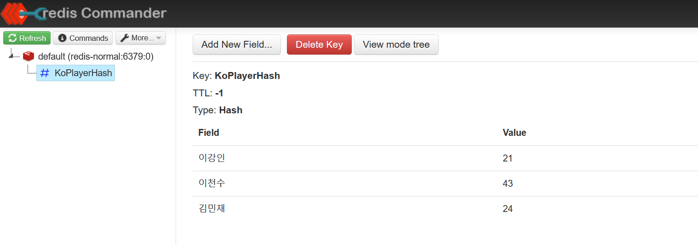

# webflux - Reactive Redis Start (1) - Hash 

처음 ReactiveRedis Operation 을 사용할 때 일반적인 자바 프로그램이나 코틀린에서 절차적으로  RedisOperation 을 사용할 때에 비해 더 어려웠었다. 절차적으로 하면 한줄 쓰고 다음줄 쓰면 되던 옛날 방식의 절차적인 방식에 비해 함수형은 조금은 더 생각이 필요했다.<br>

Reactive Redis 는 함수형으로 작성해야 하다보니 처음 접할때는 조금 어려웠었다. 막상 사용하다보니, 스코프 내에서 불변성이 확보된다는 점이라든가 이런 점은 장점으로 다가왔다.<br>

오늘 정리하는 문서는 Hash 자료구조 사용하는 방법에 대한 내용이다. 별 내용 없다. <br>

환경설정, 프로젝트 세팅 에 대해서는 별도의 문서에 정리해둘 예정이다.<br>

<br>

# ConnectionConfig

접속정보 설정이다.

`ReactiveRedisConnectionFactoryConfig.kt`

```kotlin
import org.springframework.beans.factory.annotation.Value
import org.springframework.context.annotation.Bean
import org.springframework.context.annotation.Configuration
import org.springframework.data.redis.connection.ReactiveRedisConnectionFactory
import org.springframework.data.redis.connection.lettuce.LettuceConnectionFactory

@Configuration
class ReactiveRedisConnectionFactoryConfig (
    @Value("\${just-test.redis.host}")
    val host: String,

    @Value("\${just-test.redis.port}")
    val port: Int
){
    @Bean(name = ["reactiveRedisConnectionFactory"])
    fun reactiveRedisConnectionFactory() : ReactiveRedisConnectionFactory {
        return LettuceConnectionFactory(host, port)
    }
}
```

<br>


# RedisConfig

애플리케이션 전역에서 사용할 **Reactive**RedisTemplate 을 Bean으로 선언했다.

`RedisConfig.kt`

```kotlin
import org.springframework.context.annotation.Bean
import org.springframework.context.annotation.Configuration
import org.springframework.data.redis.connection.ReactiveRedisConnectionFactory
import org.springframework.data.redis.core.ReactiveRedisTemplate
import org.springframework.data.redis.serializer.RedisSerializationContext
import org.springframework.data.redis.serializer.StringRedisSerializer

@Configuration
class RedisConfig (
){

    @Bean(name = ["playerAgeMap"])
    fun playerAgeMap(
        reactiveRedisConnectionFactory: ReactiveRedisConnectionFactory
    ) : ReactiveRedisTemplate<String, String>{
        val keySerializer: StringRedisSerializer = StringRedisSerializer()
        val valSerializer: StringRedisSerializer = StringRedisSerializer()

        val builder: RedisSerializationContext.RedisSerializationContextBuilder<String, String> =
            RedisSerializationContext.newSerializationContext(keySerializer)

        val context : RedisSerializationContext<String, String> = builder
            .key(keySerializer)
            .hashKey(keySerializer)
            .value(valSerializer)
            .hashValue(valSerializer)
            .build()

        return ReactiveRedisTemplate(reactiveRedisConnectionFactory, context)
    }


}
```

<br>

# Test

`ReactiveRedisHashTest.kt`

```kotlin
import org.junit.jupiter.api.Test
import org.springframework.beans.factory.annotation.Autowired
import org.springframework.beans.factory.annotation.Qualifier
import org.springframework.boot.test.context.SpringBootTest
import org.springframework.data.redis.core.ReactiveRedisTemplate
import reactor.test.StepVerifier

@SpringBootTest
class ReactiveRedisHashTest {

    @Autowired
    @Qualifier("playerAgeMap")
    lateinit var playerAgeMap : ReactiveRedisTemplate<String, String>

    @Test
    fun `축구국가대표팀의 각 선수들의 나이를 입력해보기`(){
        val hash = playerAgeMap.opsForHash<String, String>()
        val namespace = "KoPlayerHash"
        hash.putIfAbsent(namespace, "이강인", "21").subscribe()
        hash.putIfAbsent(namespace, "이천수", "43").subscribe()
        hash.putIfAbsent(namespace, "김민재", "24").subscribe()

        val msp = buildMap<String,Int>{
            put("이강인",21)
            put("이천수",43)
            put("김민재",24)
        }

        msp.map{
            StepVerifier.create(hash.get(namespace, it.key))
                .expectSubscription()
                .expectNext(it.value.toString())
                .expectComplete()
                .verify()
        }
    }

}
```

<br>

저장된 데이터를 확인해보면 아래와 같이 잘 저장되었음을 확인가능하다.


