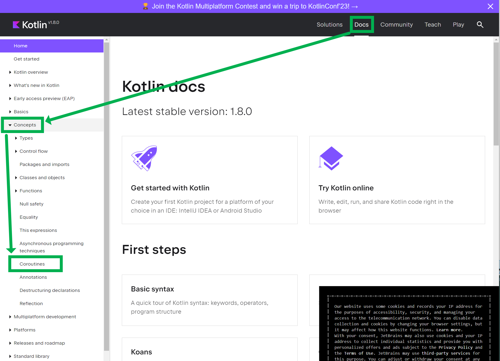
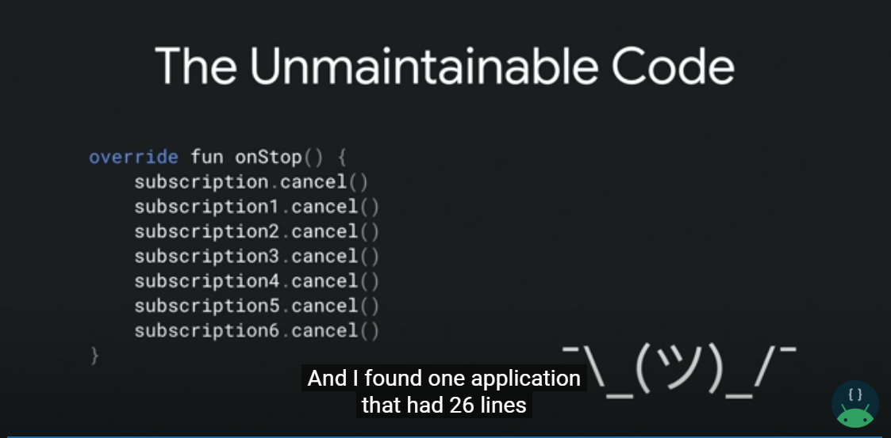
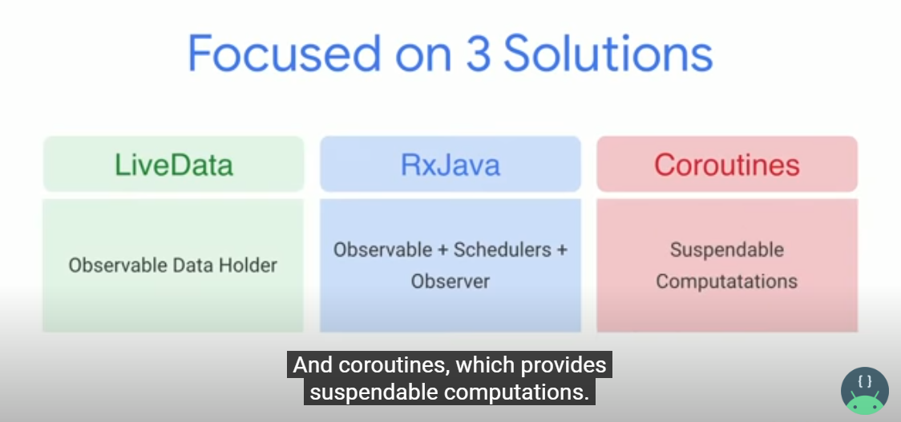
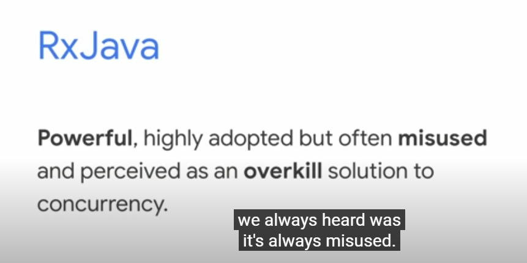
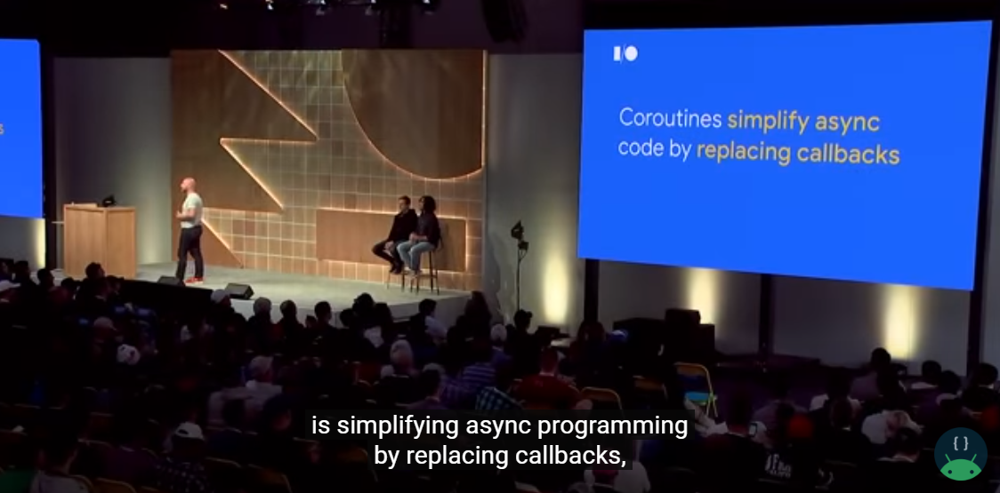
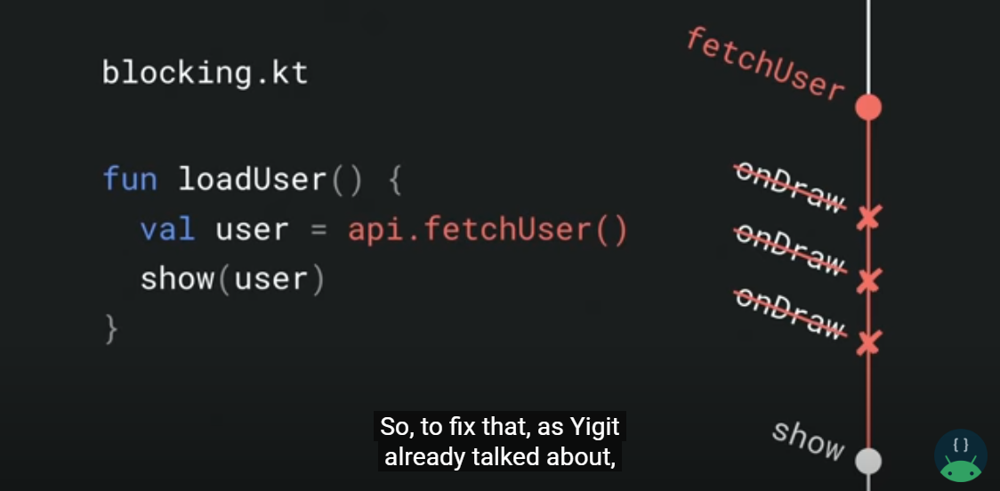
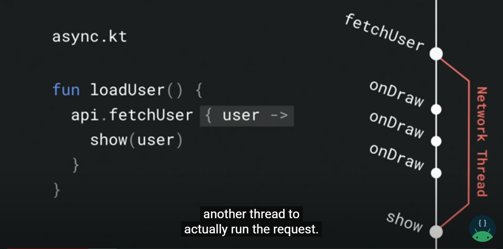
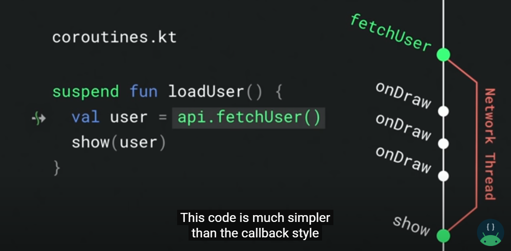

# 새차원 강의 요약 1. Why Coroutines

스터디를 하면서 여러번 코루틴을 접해봤지만, 정확하게 개념으로 남겨두고 싶어서 정리를 시작.<br>

코루틴의 역사부터...정리를 하다니 내가 잠깐 어떻게 된건가 싶기도...<br>

코루틴은 알고보니 1958년에 만들어진 개념이고, 멜빈 콘웨이에 의해 만들어진 용어라고 한다.<br>

이 내용들을 번역해서 위키백과에 정리해주신 분들도 존경스럽다.<br>

읽다보니 코루틴은 코틀린에만 있는 개념이 아니었다. Go 언어도 있고, 코틀린에서도 지원하고 C++/자바스크립트/루비/파이썬/얼랭/파스칼/펄 등등 여러 언어에서도 지원하고 있다고 한다.<br>

자바 개발자인 나로서는 자바에서는 지원안된다는 사실에는 잠깐 놀랐다.<br>

<br>


## 코루틴 관련 자료

[kotlinlang.org](https://kotlinlang.org/) 에 방문한다.<br>

상단 DOC > 좌측 "Concepts" > "Coroutines" 메뉴 클릭



<br>


## Coroutine ?

코루틴(coroutine) 은 루틴의 일종이다. 협동(co) 루틴이다.<br>

`Co` 라는 접두사는 collaborator 라는 단어에 쓰인 것 처럼 with, together 와 같은 뜻으로 협동한다는 의미이다. <br>

코루틴에 대해 잘 모르는 사람들은 코루틴이 신기술이라고 하는 사람들이 많다. 하지만 코루틴은 1958년에 등장한 개념이다(wiki 참고). 

> 도널드 커누스에 따르면 멜빈 콘웨이는 1958년 코루틴(coroutine)이라는 용어를 만들어냈으며 당시 그는 이를 어셈블리 프로그램에 적용했다. 코루틴에 관해 설명된 최초의 출판물은 1963년에 등장하였다.

참고: [https://ko.wikipedia.org/wiki/코루틴](https://ko.wikipedia.org/wiki/%EC%BD%94%EB%A3%A8%ED%8B%B4)<br>

<br>

> **Coroutines** are [computer program](https://en.wikipedia.org/wiki/Computer_program) components that generalize [subroutines](https://en.wikipedia.org/wiki/Subroutine) for [non-preemptive multitasking](https://en.wikipedia.org/wiki/Non-preemptive_multitasking), by allowing execution to be suspended and resumed. Coroutines are well-suited for implementing familiar program components such as [cooperative tasks](https://en.wikipedia.org/wiki/Cooperative_multitasking), [exceptions](https://en.wikipedia.org/wiki/Exception_handling), [event loops](https://en.wikipedia.org/wiki/Event_loop), [iterators](https://en.wikipedia.org/wiki/Iterator), [infinite lists](https://en.wikipedia.org/wiki/Lazy_evaluation) and [pipes](https://en.wikipedia.org/wiki/Pipeline_(software)).
>
> - 코루틴은 협력작업, 예외, 이벤트루프, 반복자, 무한목록(infinite lists), 파이프와 같은 친숙한 프로그램 구성 요소를 구현하는 데 적합합니다.

참고: [https://en.wikipedia.org/wiki/Coroutine](https://en.wikipedia.org/wiki/Coroutine)

<br>

코루틴은 이전에 자신의 실행이 마지막으로 중단(suspend) 되었던 지점의 다음 장소에서 실행을 재개한다.<br>

<br>

## 주요 장점/특징

참고: [http://developer.android.com/kotlin/coroutines](https://developer.android.com/kotlin/coroutines)

주요 기능들은 아래와 같다.<br>

코루틴은 Android의 비동기 프로그래밍에 권장되는 솔루션입니다. 주목할 만한 기능은 다음과 같습니다.<br>

- **경량**: 코루틴을 실행 중인 스레드를 차단하지 않는 [*정지*](https://kotlinlang.org/docs/reference/coroutines/basics.html)를 지원하므로 단일 스레드에서 많은 코루틴을 실행할 수 있습니다. 정지는 많은 동시 작업을 지원하면서도 차단보다 메모리를 절약합니다.
- **메모리 누수 감소**: [*구조화된 동시 실행*](https://kotlinlang.org/docs/reference/coroutines/basics.html#structured-concurrency)을 사용하여 범위 내에서 작업을 실행합니다.
- **기본으로 제공되는 취소 지원**: 실행 중인 코루틴 계층 구조를 통해 자동으로 [취소](https://kotlinlang.org/docs/reference/coroutines/cancellation-and-timeouts.html)가 전달됩니다.
- **Jetpack 통합**: 많은 Jetpack 라이브러리에 코루틴을 완전히 지원하는 [확장 프로그램](https://developer.android.com/kotlin/ktx)이 포함되어 있습니다. 일부 라이브러리는 구조화된 동시 실행에 사용할 수 있는 자체 [코루틴 범위](https://developer.android.com/topic/libraries/architecture/coroutines)도 제공합니다.

<br>


## 어디에 쓰지?

아래는 안드로이드 개발자 레퍼런스에서 명시하는 코루틴에 대한 특징이다.

참고: [http://developer.android.com/kotlin/coroutines](https://developer.android.com/kotlin/coroutines)

> *코루틴*은 비동기적으로 실행되는 코드를 간소화하기 위해 Android에서 사용할 수 있는 동시 실행 설계 패턴입니다. [코루틴](https://kotlinlang.org/docs/coroutines-guide.html)은 Kotlin 버전 1.3에 추가되었으며 다른 언어에서 확립된 개념을 기반으로 합니다.
>
> Android에서 코루틴은 기본 스레드를 차단하여 앱이 응답하지 않게 만들 수도 있는 장기 실행 작업을 관리하는 데 도움이 됩니다. 코루틴을 사용하는 전문 개발자 중 50% 이상이 생산성이 향상되었다고 보고했습니다. 이 주제에서는 Kotlin 코루틴을 사용하여 이러한 문제를 해결해 더 명확하고 간결한 앱 코드를 작성하는 방법을 설명합니다.

<br>

참고: [https://developer.android.com/codelabs/kotlin-coroutines#0](https://developer.android.com/codelabs/kotlin-coroutines#0)

Coroutines are a Kotlin feature that converts async callbacks for long-running tasks, such as database or network access, into *sequential* code.

- 코루틴은 데이터베이스 또는 네트워크 액세스와 같은 장기 실행 작업에 대한 비동기 콜백을 *순차적* 코드로 변환하는 Kotlin 기능입니다.

<br>


## 사용 예 : Google I/O'19

참고: [Understand Kotlin Coroutines on Android (Google I/O'19)](https://www.youtube.com/watch?v=BOHK_w09pVA)

아래와 같은 코드가 있다고 해보자.<br>

아래 코드는 네트워크 call 을 메인스레드에서 하는 코드인데, 안드로이드에서는 메인스레드에서 네트워크 call 을 하면 `NetworkOnMainThreadException` 을 발생시킨다.

```kotlin
// 네트워크 call 을 하면서 메인스레드에서 네트워크 call 을 하기에 Exception 이 발생하개 된다.
val user = fetchUserData() // NetworkOnMainThreadException
textView.text = user.name
```

<br>

NetworkOnMainThreadException 문제 때문에 아래와 같이 스레드 처리를 하는 로직으로 수정했다.

```kotlin
thread {
    val user = fetchUserData()
    textView.text = user.name // CalledFromWrongThreadException
    // UI 스레드에서 업데이트 해야 하는데, 지금 UI 스레드가 아닌 별도의 스레드에서 업데이트 하기 때문에 Exception 을 낸다.
}
```

<br>

이 코드는 `CalledFromWrongThreadException` 을 발생시킨다. 왜냐하면, UI 스레드에서 업데이트해야 하는데, 지금 UI 스레드가 아닌 별도의 스레드에서 업데이트 하기에 `CalledFromWrongThreadException` 을 발생시킨다.<br>

<br>

위의 이유로 인해 아래와 같이 fetchUserData 함수는 스레드를 이용해서 호출하고,  

메인 스레드로 스위치할 수 있도록 callback 을 이용해 UI 스레드를 접근하는 코드를 작성하게 됐다.

(callback 을 이용해 네트워크 call 이 끝나면 `{textView.text = user.name}` 을 수행하게끔 수정해줬다.)

```kotlin
fetchUserData { user -> // callback
	textView.text = user.name
}
```

이렇게 수정하더라도 결국은 `OutOfMemoryError`  가 발생하게 된다. UI 관련해서 clear, dispose 하면서 UI 관련 리소스 메모리도 관리를 해줘야 하고, 잘못하면 메모리 문제가 발생(이미 해제된 리소스 접근 등)할 수도 있다. 그리고 이런 것들을 관리해주려면 아래와 같은 cancel 코드들이 많이 생긴다.



이렇게 스레드 해제를 하면 유지보수 시에도 일일이 찾아가면서 수정을 해줘야 할 뿐만 아니라, 애플리케이션의 요구사항이 많아질 수록 관리가 쉽지 않아진다.

<bR>

그리고 여기에 대해서 3가지의 다양한 해결책들을 이야기한다.



<br>

Live Data를 사용하는 방식에 대해서는 아래와 같이 설명한다.


<br>


RxJava 에 대해서는 아래와 같이 이야기한다. (RxJava의 경우 Reactive Streams 를 사용하는 WebFlux와 유사하다고 생각하면 된다.)

> 강력하고 많이 채택되었지만 종종 오용되고 동시성에 대한 과도한 솔루션으로 인식됩니다.



<br>


Coroutines 에 대해서는 아래와 같이 이야기한다.

> 최상의 솔루션처럼 보이지만 확장 기능의 성숙이 필요하고 개발자는 가파른 학습 곡선이 기다리고 있다고 생각합니다...


<br>

**코루틴으로 전환**<br>

코루틴에 대해 설명하는 담당자분이 바뀌면서 코루틴에 대해서는 아래와 같이 설명한다.



<br>

방금 전의 해결하기 어려웠던 코드들을 코루틴으로 해결하는 과정들을 설명해준다.

먼저 fetchUser와 UI를 렌더링하는 코드들이 아래와 같이 있다고 해보자.



메인 스레드에서 fetchUser 를 호출하고 있다. 이 경우 메인 스레드에서 네트워크 호출을 하면서 UI 스레드가 블로킹상태에 진입하면서 UI를 그려야 하는 동작(onDraw)들이 펜딩된다.

그리고 앱은 죽게 된다. show 텍스틑가 회색으로 표시되어있다.

<br>

이번에는 두번째로 살펴봤던 callback 스타일의 코드로 해결했던 해결책이다. 새로운 스레드를 생성해서 네트워크 동작을 그 스레드에서 동작하게끔 하는 방식이다. 이 방식은 해결은 되지만 관리(Cancel 로직의 산재 등)가 갈수록 복잡해진다는 점이 발생한다.<br>



<br>

이번에는 마지막으로 코루틴으로 해결하는 해결책이다. 

아래 코드같은 방식은 callback 을 통해 다른 스레드에서 실행하도록 별도처리를 하지 않아도 `api.fetchUser()` 라는 코드가 별도의 스레드에서 비동기 방식으로 수행되게 된다. 별도의 스레드 처리는 코틀린 코루틴이 담당하게 된다.



<br>


참고 영상 속에서는 이렇게 작성한 coroutines.kt 와 같은 코드를 Dream Code 라고 하는데, 이렇게 꿈같은 코드를 coroutine 이 가능하게 한다고 설명하고 있다.<br>

<br>


