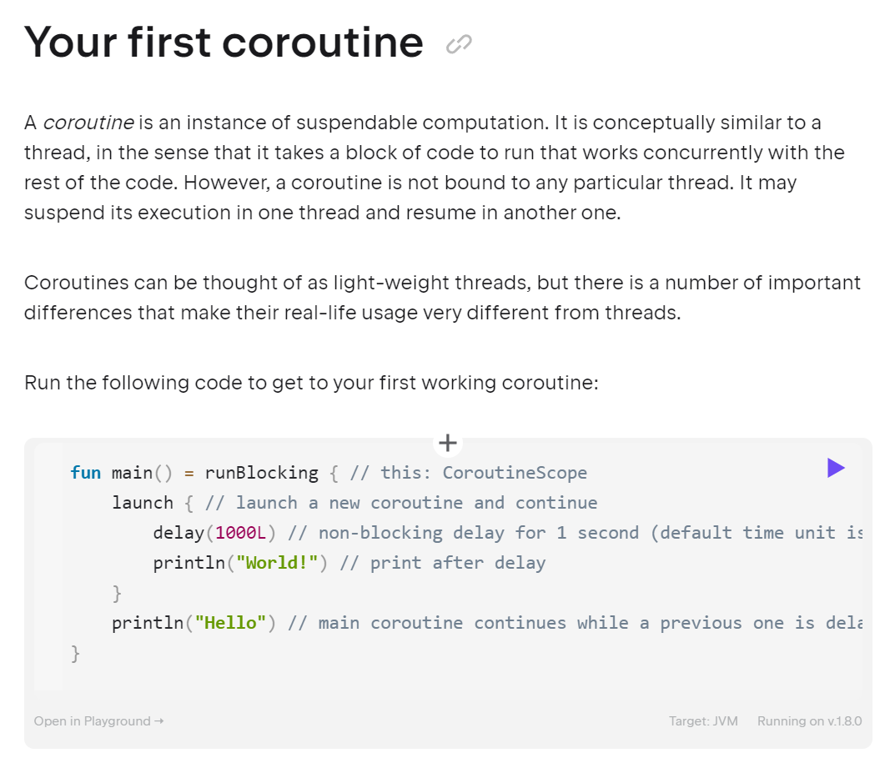
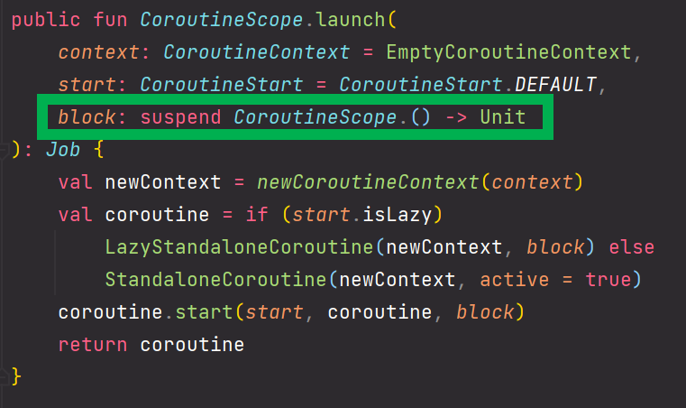
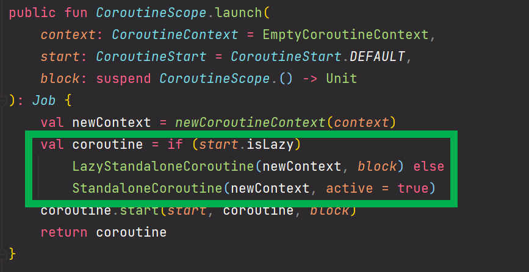
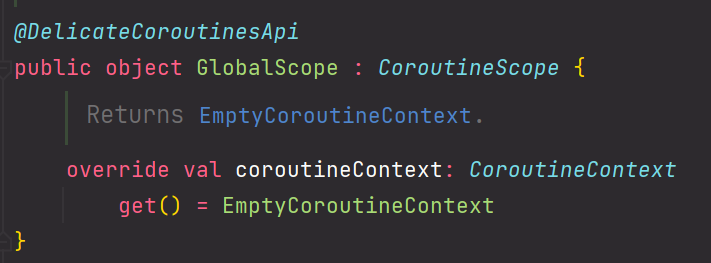
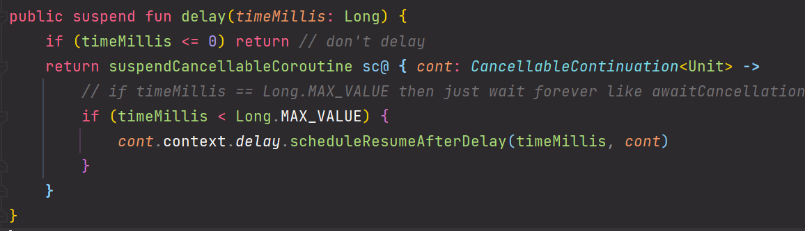

# 새차원 강의요약 2.Basics

이번에 정리할 내용은 [kotlinlang.org/docs/coroutines-basics](https://kotlinlang.org/docs/coroutines-basics.html) 에 나온 내용이다. 공식 자료를 보고 한번에 정리하면 좋겠지만, 처음 공부할 때 멘토가 있으면 나쁜 방향으로 빠지지 않는다. <br>

이런 이유로 새차원이라는 유튜버님의 [강의](https://www.youtube.com/watch?v=14AGUuh8Bp8)를 참고해서 공부했고 정리했다. 강의 시간이 29분인데도 1시간 가까이 걸렸다.<br>


오늘 다루는 내용을 목차로 정리해봤다.


<br>

# 참고자료

- [kotlinlang.org/docs/coroutines-basics](https://kotlinlang.org/docs/coroutines-basics.html) 
- [새차원, 코틀린 코루틴(Coroutines) 2. Basics](https://www.youtube.com/watch?v=14AGUuh8Bp8)

<br>

# 소스코드

- https://github.com/gosgjung/study-kopring/tree/main/kotlin-coroutines


# 참고

kotlinlang.org 의 docs 페이지 내의 Basic 챕터에서 가장 처음 나타나는 코드는 아래와 같다. 아래 코드를 그대로 웹에서 실행할 수도 있는데, 웹에서 실행하는 것은 아무래도 속도도 느리고, 원하는 대로 수정하기도 그리 쉽지 않다.



<br>

그리고 제일 중요한 것은 코드를 백업해두고 복습이 불가능하다. 그래서 내 경우는 Intellij 에서 코드를 작성하고 github 에 커밋해서 관리하는 식으로 스터디를 진행하기로 했다.<br>

<br>

# Coroutine 이란?

Coroutines can be thought of as light-weight threads, but there is a number of important differences that make their real-life usage very different from threads.

코루틴은 가벼운 스레드로 생각할 수 있지만 실생활에서 **스레드와 매우 다르게 사용하는 중요한 차이점**이 많이 있습니다.

- GlobalScope, CoroutineScope
- runBlocking, launch
- etc...

<br>

Coroutine 객체는 runBlocking, launch 함수 등을 통해 만든다. 그리고 runBlocking, launch 함수를 흔히 코루틴 빌더 라고 부른다.<br>

코루틴 빌더는 코루틴 객체를 생성하는 역할을 한다.(빌더 패턴을 생각해보자. 빌더패턴은 객체를 생성할 때 사용한다.)<br>

<br>

예를 들어 아래의 코드가 있다고 해보자.

```kotlin
fun main = runBlocking{ // 1)
    GlobalScope.launch{ // 2)
        delay(3000L)
        println("World!")
    }
    
    println("Hello,")
    delay(2000L)
}
```

<br>

위의 코드에서 코루틴 객체가 생성된 부분은 1\), 2\) 이다. `{...}` 으로 감싸져 있는 곳이 코루틴객체의 영역이다. 흔히 코틀린에서 함수안에 가장 마지막 파라미터가 람다일 경우 `{...}` 으로 따로 빼서 정의하는데, `{...}` 으로 감싸진 코루틴 객체의 영역이 바로 코틀린의 람다라고 생각하면 된다.<br>



<br>

launch 함수의 정의를 보면, 파라미터의 기본값을 세팅해주고 있고 가장 마지막 파라미터인 `block` 이 람다타입인 것을 확인 가능하다.<br>

<br>


# Your First coroutine

아래 코드를 실행해보자. (코틀린랭 docs 의 코드를 그대로 가져왔다.)

```kotlin
fun main() = runBlocking { // this: CoroutineScope
    GlobalScope.launch { // launch a new coroutine and continue
        delay(1000L) // non-blocking delay for 1 second (default time unit is ms)
        println("World!") // print after delay
    }
    println("Hello") // main coroutine continues while a previous one is delayed
}
```

<br>

출력결과

```plain
Hello
World!
```


**launch**<br>

위의 코드에서 `launch`  는 **코루틴 빌더**다. 코루틴 빌더는 여러 종류가 있다. 그리고 `launch` 뒤의 `{...}` 은 스코프라고 한다.<br>

launch 의 내부 소스를 IDE를 통해 들여다 보면 아래와 같다. 자세히 보면 새로운 **코루틴 객체**를 만들어내는 것을 볼 수 있다.<br>

(LazyStandaloneCoroutine, StandaloneCoroutine 객체 중 하나를 선택해서 인스턴스로 생성하고 있다.)<br>

빌더 패턴이라는 의미를 잘 떠올려보자. 빌더 패턴을 사용할 때 흔히 내부 클래스를 통해서 객체를 만들때 빌더패턴이라는 용어를 자주 사용한다. **코루틴 빌더**는 **빌더** 패턴 처럼 코루틴 객체를 생성해주는 역할을 하기에 빌더 라는 이름을 붙인 것으로 보인다.<br>



<br>

**GlobalScope**<br>

GlobalScope를 IDE를 통해 들여다보면 아래와 같이 정의되어있음을 볼 수 있다. CoroutineScope 라는 interface를 implements 한 구체 클래스다.



<br>

GlobalScope 객체는 프로그램 전체에 대한 라이프타임을 가진다. 전역 스코프라고 생각하면 된다.<bR>

 <br>


## 용어정리) launch, delay, runBlocking

이 부분은 강의에서는 자세히 설명을 해주지는 않아서 kotlinlang 에 있는 내용을 어느 정도는 요약해두었다.<br>


### launch

[launch](https://kotlinlang.org/api/kotlinx.coroutines/kotlinx-coroutines-core/kotlinx.coroutines/launch.html) is a *coroutine builder*. It launches a new coroutine concurrently with the rest of the code, which continues to work independently. That's why `Hello` has been printed first.

launch 는 코루틴 빌더다. 독립적으로 계속 작동하는 나머지 코드와 동시에 새로운 코루틴을 시작합니다. 그래서 `Hello`가 먼저 인쇄되었습니다.<br>


### delay

[delay](https://kotlinlang.org/api/kotlinx.coroutines/kotlinx-coroutines-core/kotlinx.coroutines/delay.html) is a special *suspending function*. It *suspends* the coroutine for a specific time. Suspending a coroutine does not *block* the underlying thread, but allows other coroutines to run and use the underlying thread for their code.

지연은 특별한 *정지 기능*입니다. 특정 시간 동안 코루틴을 *일시 중단*합니다. 코루틴을 일시 중단해도 기본 스레드가 *차단*되지는 않지만 다른 코루틴이 코드에 기본 스레드를 실행하고 사용할 수 있습니다.<br>


### runBlocking

[runBlocking](https://kotlinlang.org/api/kotlinx.coroutines/kotlinx-coroutines-core/kotlinx.coroutines/run-blocking.html) is also a coroutine builder that bridges the non-coroutine world of a regular `fun main()` and the code with coroutines inside of `runBlocking { ... }` curly braces. This is highlighted in an IDE by `this: CoroutineScope` hint right after the `runBlocking` opening curly brace.

runBlocking은 또한 일반 fun main()의 코루틴이 아닌 세계와 runBlocking { ... } 중괄호 내부의 코루틴이 있는 코드를 연결하는 코루틴 빌더입니다. 이는 IDE에서 다음과 같이 강조 표시됩니다. runBlocking 여는 중괄호 바로 뒤에 `this: CoroutineScope` 힌트가 표시됩니다.

<br>


## thread 를 이용해 구동해보기

위의 GlobalScope 객체의 launch 라는 코루틴 빌더를 사용해서 코루틴을 구동시키는 것 대신 `thread{}` 를 이용해서 구동해보자.

```kotlin
fun main(){
    thread{
        Thread.sleep(1000L)
        println("World!")
    }

    println("Hello,")
    Thread.sleep(2000L)
}
```


# Bridging blocking and non-blocking worlds

이번 예제는 간단하다. 

```kotlin
fun main(){
    GlobalScope.launch {
        delay(1000L)
        println("World!")
    }
    println("Hello,")
    runBlocking {
        delay(2000L) // 1)
    }
}
```

실행결과

```plain
Hello,
World! // 약 1초 뒤에 출력된다.
```

<br>


1\) : delay 함수를 runBlocking 이라는 코루틴 빌더 내에서 실행하고 있다.

- delay 함수는 suspend 키워드가 붙은 함수다. 이렇게 suspend 라는 키워드가 붙은 함수는 코루틴 빌더 내에서만 실행할 수 있다.

**delay 함수의 내부 정의**



<br>


# rewritten in a more idiomatic way

관용적인 방식(자주 사용되는 방식)으로 표현하면 아래와 같다.

```kotlin
fun main() = runBlocking<Unit> {
    GlobalScope.launch {
        delay(1000L)
        println("World!")
    }
    println("Hello,")
    delay(2000L)
}
```

자세히 보면 GlobalScople 밖에서 실행시키는 delay 구문을 `runBlocking<Unit>` 에서 실행하고 있음을 확인할 수 있다.<br>

즉, 모든 코드를 `runBlocking` 으로 감싸서 실행하고 있다.<br>

<br>


# Waiting for a job

launch 가 반환하는 객체는 Job 객체다. 

```kotlin
fun main() = runBlocking {
    val job = GlobalScope.launch {
        delay(1000L)
        println("World!")
    }
    println("Hello,")
    job.join()
}
```


runBlocking 이 만들어낸 Coroutine Scope와 GlobalScope.launch 가 만들어낸 코루틴 스코프는 각각 다르다. 

서로 다른 코루틴 빌더에서 만들어낸 스코프이기에 join 구문을 사용해서 서로 다른 스코프간 Job을 기다리는 방식으로 순서를 제어하게 된다.<br>

마치 CompletableFuture, Future 등과 비슷한 형태를 띈다. 자세한 설명은 건너뛰기로...결정<br>

<br>

여기서 외워둘 내용은 서로 다른 Coroutine Socpe 간에는 job 을 기다리는 방식으로 순서를 제어한다는 사실이다.<bR>


# Structured Concurrency

상위 코루틴 스코프 내에서 코루틴 스코프를 하나 만들어서 새로운 하위 스코프를 만들때, 상위 스코프 객체를 사용해 코루틴 스코프를 생성하면 같은 코루틴 스코프 내에서 계층적인 동시성 흐름이 만들어진다. 이 것을 Structured Concurrency 라고 부른다.<br>

예제를 천천히 보다보면 알겠지만, 코루틴 스코프 내에서 Structured Concurrency 는 순서대로 실행됨을 보장한다.<br>

Structured Concurrency 를 사용하면, join() 등을 이용해 job 들을 직접 일일이 관리하지 않아도 여러 코루틴들을 원하는 순서대로 구성해서 기다려 줄 수 있게 된다.

<br>


예를 들어 아래와 같은 코드가 있다고 해보자. job 객체가 여러개 생성되어 있고 일일이 join을 해주고 시점도 맞춰줘야 한다.

```kotlin
fun main() = runBlocking { 
    val job1 = GlobalScope.launch { 
        delay(1000L)
        println("World!")
    }
    
    val job2 = GlobalScope.launch { 
        delay(1000L)
        println("World!")
    }
    
    println("Hello,")
    job1.join()
    job2.join()
}
```

<br>

Structured Concurrency 는 위와 같은 문제를 방지하기 위해 사용하는 방식이다. 부모 스코프를 그대로 물려바아서 그 다음 작업을 launch할때 부모스코프의 launch를 호출해서 생성된 스코프 내에서 동작을 하도록 기술하는 방식이다.<Br>

위의 코드를 Structured Concurrency 를 따르도록 수정하면 아래와 같다.<br>

```kotlin
fun main() = runBlocking { // 1)

    // 2) : runBlocking 이 1)에서 생성한 스코프를 기반으로 launch 메서드를 호출하고 있다.
    this.launch{
        delay(1000L)
        println("World")
    }

    println("Hello")
}
```

<br>

1\) : runBlocking 을 통해 코루틴 스코프를 만들었다.

2\) : 1)에서 생성된 코루틴 스코프의 launch 를 호출했다. 따라서 상위단의 스코프를 그대로 활용해서 그 하위 스코프를 만들었다. 즉, 중첩된 구조의 스코프다.<br>

<bR>

이번에는 아래와 같이 launch 구문을 차례대로 5번을 실행시키는 구문을 보자.<br>

```kotlin
fun main() = runBlocking {

    this.launch{
        delay(1000L)
        println("World1")
    }

    this.launch{
        delay(1000L)
        println("World2")
    }

    this.launch{
        delay(1000L)
        println("World3")
    }

    this.launch{
        delay(1000L)
        println("World4")
    }

    this.launch{
        delay(1000L)
        println("World5")
    }

    println("Hello")
}
```


출력결과

```plain
Hello
World1
World2
World3
World4
World5
```


출력결과가 마치 순차적으로 실행시킨 것과 같은 효과를 내었다. 만약 join 구문을 사용해서 서로 다른 스코프간 Job을 기다리는 방식으로 했었다면, join구문이 5개를 만들어야 했을 것이다. 그리고 cancel 시키는 로직 역시 5개 만들어야 했을 것이다.<br>

<br>

**this 생략**

- 위의 예제에서 runBlocking 이 생성한 코루틴 스코프를 사용해 그 하위에서 코루틴 스코프를 생성하려 할 경우 아래 코드 처럼 this를 생략해도 된다.
- 이미 this가 runBlocking 이 생성한 코루틴 스코프를 가리키는 것이기 때문이다.

Ex06_3.kt

```kotlin
fun main() = runBlocking {
    launch {
        delay(1000L)
        println("World!")
    }
    println("Hello,")
}
```

<br>

출력결과

```plain
Hello,
World!
```


# Extract function refactoring

- suspend함수는 suspend함수 내에서만 호출할 수 있다.
- 또는 suspend함수는 코루틴 스코프 안에서만 호출할 수 있다.

<br>

이번에는 `suspend` 가 적용된 함수를 하나 만들고 이것을 실행해보는 예제다.

Ex07.kt

```kotlin
fun main() = runBlocking {
    launch {
        myWorld() // 1)
    }
    println("Hello,")
}

suspend fun myWorld(){ // 2) suspend 키워드가 없으면 delay 함수 호출 부분에서 컴파일 에러를 낸다.
    delay(1000L)
    println("World.")
}
```


- 1\) 딜레이함수와 println() 을 호출하는 로직을 `myWorld()` 라는 메서드로 분리했다.
- 2\) suspend 키워드와 함께 myWorld() 메서드를 정의했다.
  - 내부에서 delay() 라는 suspend 함수를 호출하고 있다.
  - suspend 메서드가 내부에서 사용된다면, caller 측도 suspend함수여야 한다.
  - **즉, suspend함수는 suspend함수 내에서만 호출할 수 있다.**

<br>


# Coroutines ARE light-weight

코루틴은 스레드에 비해 가볍다.(light-weight)<br>

스레드 기반으로 아래의 10만번 print 예제를 실행하면 느리다. 더 많이 실행할 경우 out of memory error 가 발생할 수도 있다.<br>

왜냐하면, 스레드 하나는 메모리가 크기 때문<br>

<br>


10만개의 코루틴을 한번에 만들어서(launch를 10만번)

1초 뒤에 `.` 을 찍는 예제다.

`Ex08.kt`

```kotlin
fun main() = runBlocking{
    repeat(100_000){
        launch{
            delay(1000L)
            print(".")
        }
    }
}
```


출력결과<br>

점을 10만개나 생성하는데, 느려지는 증상없이 출력된다.<br>

<br>

이번에는 위의 예제를 luanch 를 사용하는 것이 아니라 thread{} 로 돌려본다.(코루틴이 아니라 스레드를 사용해서)<br>


`Ex08_1.kt`

```kotlin
fun main() = runBlocking {
    repeat(100_000){
        thread{
            Thread.sleep(1000L)
            print(".")
        }
    }
}
```

<bR>

출력결과<br>

내 경우는 7초 이상을 점을 찍고 있었고 프로그램이 멈추지 않았다.

<br>

이것으로 보아 코루틴이 Thread 보다 더 가볍다(light-weight)는 사실을 알게 되었다.<br>

<br>


# Global coroutines are like daemon threads

코루틴은 데몬 스레드 처럼 동작한다.

코루틴이 계속 실행되고 있다고 해서 프로세스는 계속 유지되는 것은 아니다.<br>

데몬스레드 처럼 프로세스가 살아있을 때만 유지될 수 있다.<br>

프로세스가 끝나면 데몬 스레드도 끝난다.<br>

<br>


`Eg10.kt` 

```kotlin
fun main() = runBlocking { 
    GlobalScope.launch {  // 1)
        repeat(1000){ i ->  // 2)
            println("I'm sleeping $i ...")
            delay(500L)
        }
    }
    
    // 3)
    delay(1300L)
}
```


1\)

- 코루틴이 GlobalScope 에서 launch 된다.<br>

2\)

- 1000 번 반복을 하면서 500ms 간격으 `I'm sleeping $i ... ` 이라는 문구를 출력한다.

3\)

- main 함수는 1.3 초 뒤에 끝난다.

<br>


이렇게 되면 main 함수가 끝난 뒤에는 GlobalScope 에 정의해둔 0.5초마다 출력하는 문구는 살아있지 못한다.

<br>


