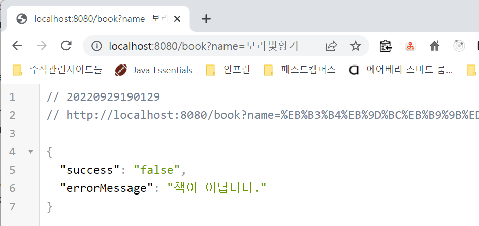

# Webflux 에서 ErrorWebExceptionHandler 사용하기 - 예외를 정상응답과 메시지로 변환해전달하기 (1) (Kotlin 버전)

Spring MVC 에서는 ControllerAdvice 를 활용해 예외에 대한 처리를 공통화하고 예외에 대한 응답과 예외에 대한 메시지에 대해 enum으로 상수로 정의를 해서 사용하는 편이다.<br>

WebFlux 에서는 ErrorWebExchangHandler로 비슷한 역할을 수행할 수 있다. 이 방법은 java 기반의 webFlux에서도 동일하게 동작하는데 오늘 정리한 소스코드를 java 코드로 변환해서 작성해야 한다.<br>

<br>

일단 정리 시작!!! 고고<br>

<br>

# API

API 는 별 내용은 없다. `http://localhost:8080/book?name=[책이름]` 과 같은 API 가 있다고 해보자. 예제 용도의 소스코드라 굉장히 단순하고 웃긴 코드이지만 일단 작성했다.<br>

`BookApiController.kt`

```kotlin
package io.testprj.kopring_webflux.book.api

import io.testprj.kopring_webflux.book.application.BookNameChecker
import io.testprj.kopring_webflux.global.response.ApiResponse
import org.springframework.web.bind.annotation.GetMapping
import org.springframework.web.bind.annotation.RequestMapping
import org.springframework.web.bind.annotation.RequestParam
import org.springframework.web.bind.annotation.RestController

@RestController
@RequestMapping("book")
class BookApiController (
    val bookNameChecker: BookNameChecker
){
    @GetMapping("")
    fun getBookName(@RequestParam(defaultValue = "") name: String) : ApiResponse<Boolean> {
        return ApiResponse(
            message = "정상요청입니다",
            body = bookNameChecker.checkIfBook(name),
            description = "설명..."
        )
    }
}
```

<bR>

자세히 보면 `bookNameChecker : BookNameChecker` 를 의존성주입 받고 있는 것을 볼수 있다. 예제를 위해 예외를 발생시키는 컴포넌트 또는 서비스를 가정해야 해서 만든 컴퍼넌트가 `BookNameChecker` 클래스다.<br>

<br>

# BookNameChecker 클래스

BookNameChecker 클래스는 아래와 같다. 예제를 위해 굉장히 단순하게 가정한 로직이다.

**checkIfBook 메서드**

- 책 이름이 '광복절특사'일때 : false 를 리턴
- 책 이름이 '보라빛향기'일때 : `ThatIsNotABookException` 예외를 throw
- 그외의 경우는 true 를 리턴

<br>

**checkIfExist 메서드**

- 책 이름이 '해변의 카프카'일때 : `NoSuchBookExistException` 예외를 throw
- 책 이름이 '심장과 혈관에 힐링을 주는 음악' 일때 : `NoSuchBookExistException` 예외를 throw

<br>

```BookNameChecker.kt```

```kotlin
package io.testprj.kopring_webflux.book.application

import io.testprj.kopring_webflux.global.exception.NoSuchBookExistException
import io.testprj.kopring_webflux.global.exception.ThatIsNotABookException
import org.springframework.stereotype.Component

// 단순 예제를 위한 클래스.
// 실무에서 이런 코드가 있지는 않다...
// 예제를 위해 재미를 위해 단순하고 직관적인 예를 위해 작성함.
@Component
class BookNameChecker {

    fun checkIfBook(bookName: String): Boolean{
        if("광복절특사" == bookName){
            return false
        }
        else if("보라빛향기" == bookName){
            throw ThatIsNotABookException()
        }
        return true
    }

}
```

<br>

# ErrorWebExceptionHandler 설정 - Exception 을 Controller 계층에서 분류후 Response로 변환

SpringMVC에서는 보통 ControllerAdvice 를 사용헤 Exception 을 ErrorResponse 등의 자체 정의 에러 리스폰스로 내려주는 로직을 작성하는 편이다. <br>

Spring Webflux 에서도 비슷하게 ControllerAdvice를 사용할 수도 있지만, ErrorWebExceptionHandler 를 사용해서 처리할 수도 있다. 오늘 정리하는 내용은 ErrorWebExceptionHandler 를 사용해 SpringWebflux 에서의 MVC 타입의 API 계층에서의 예외 처리를 정리하기로 했다. 다음 번 문서에서는 함수형 엔드포인트에서의 에러코드 처리를 정리하게 될듯.<Br>

<br>

`config/GlobalExceptionHandlerConfig.kt`

```kotlin
package io.testprj.kopring_webflux.config

import com.fasterxml.jackson.databind.ObjectMapper
import io.testprj.kopring_webflux.global.exception.ErrorResponse
import io.testprj.kopring_webflux.global.exception.ServerException
import org.springframework.boot.web.reactive.error.ErrorWebExceptionHandler
import org.springframework.context.annotation.Configuration
import org.springframework.http.HttpStatus
import org.springframework.http.MediaType
import org.springframework.web.server.ServerWebExchange
import reactor.core.publisher.Mono
import reactor.kotlin.core.publisher.toMono

@Configuration
class GlobalExceptionHandlerConfig (private val objectMapper: ObjectMapper) : ErrorWebExceptionHandler{

    // 일반 Webflux 코드
    override fun handle(exchange: ServerWebExchange, ex: Throwable): Mono<Void> {
        val errorResponse = if(ex is ServerException){
            ErrorResponse(success = "false", errorMessage = ex.message)
        } else {
            ErrorResponse(success = "false", errorMessage = "정의되지 않은 예외 발생")
        }

        with(exchange.response){
            statusCode = HttpStatus.OK
            headers.contentType = MediaType.APPLICATION_JSON
            val dataBuffer = bufferFactory().wrap(objectMapper.writeValueAsBytes(errorResponse))
            return writeWith(dataBuffer.toMono())
        }
    }

}
```

<br>

ErrorResponse 클래스는 아래와 같은 단순 클래스의 모양이다.

`ErrorResponse.kt`

```kotlin
package io.testprj.kopring_webflux.global.exception

class ErrorResponse (
    val success : String,
    val errorMessage: String
){
}
```

<br>

# Exception 정의

Exception 은 ServerException 이라는 sealed class 로 정의하고, 이 ServerException 을 상속받는 여러개의 Exception 을 정의하는 방식으로 정의했다.<br>

ServerException 은 `RuntimeException` 을 상속받은 언체크드 익셉션이다. 보통 이펙티브자바 같은 책에서는 체크드 익셉션은 언체크드 익셉션으로 예외번역하라 라는 등의 권고사항도 있고, 언체크드 익셉션에 대해서 롤백이 진행되기에 트랜잭션 코드에서도 언체크드 익셉션이 권고되는 편이다.<br>

이것과 관련해서는 따로 정리해둔 문서가 있는데, 시간이 된다면 링크도 추가해둬야겠다. 시간이 없어서 ㅠㅠ.<br>

아래는 ServerException 클래스 내에서 ServerException 클래스를 상속받는 클래스들이다.

- ThatIsNotABookException
- NoSuchBookExistException

<br>

`ServerExceptioin`

```kotlin
package io.testprj.kopring_webflux.global.exception

import io.testprj.kopring_webflux.global.code.ErrorCode

sealed class ServerException(
    val code : Int,
    override val message: String,
) : RuntimeException(message)

data class ThatIsNotABookException(
    override val message: String = ErrorCode.THAT_IS_NOT_A_BOOK.errorMessage
) : ServerException(ErrorCode.THAT_IS_NOT_A_BOOK.errorCode, message)

data class NoSuchBookExistException(
    override val message: String = ErrorCode.NO_SUCH_BOOK_EXIST.errorMessage
) : ServerException(ErrorCode.NO_SUCH_BOOK_EXIST.errorCode, message)

```

<br>

# ErrorCode 정의

위의 코드에서는 ErrorCode 라는 enum 을 사용하고 있다. 굳이 ErrorCode 라는 enum 을 사용한 이유는 에러 메시지, 에러 코드를 공통화해서 하드 코딩으로 여기저기 퍼져있지 않도록 하기 위함이다. 이렇게 해야 테스트에도 유리하고, 유지보수에도 유리하다. 너무 기초적인 이야기라서, 누구든 이런 설명은 별로 듣고싶지 않을듯.<br>

<br>

```kotlin
package io.testprj.kopring_webflux.global.code

enum class ErrorCode (
    val errorCode: Int,
    val errorMessage: String,
){
    THAT_IS_NOT_A_BOOK(40010, "책이 아닙니다."),
    NO_SUCH_BOOK_EXIST(40010, "존재하지 않는 책입니다.")
}
```

<br>

# 테스트

항상 상용 API를 PUBLIC 으로 오픈할 때는 테스트를 빡세게 해야 한다.<br>

<br>

## 1) Application 계층 테스트

`src/test/io/testprj/kopring_webflux/book/application/bookprocessor/CheckIfBookTest.kt`

```kotlin
package io.testprj.kopring_webflux.book.application.booknamechecker

import io.testprj.kopring_webflux.book.application.BookNameChecker
import io.testprj.kopring_webflux.global.exception.ThatIsNotABookException
import org.assertj.core.api.Assertions
import org.junit.jupiter.api.Test

class CheckIfBookTest {

    val bookNameChecker : BookNameChecker = BookNameChecker()

    @Test
    fun `'보라빛향기' 가 인자값으로 들어오면, ThatIsNotABookException 이 발생해야 한다`(){
        Assertions
            .assertThatThrownBy { bookNameChecker.checkIfBook("보라빛향기") }
            .isInstanceOf(ThatIsNotABookException::class.java)
    }

}
```

<br>

## 2) API 계층 테스트

`src/test/io/testprj/kopring_webflux/book/api/bookapicontroller/GetBookTest.kt`

```kotlin
package io.testprj.kopring_webflux.book.api.bookapicontroller

import io.testprj.kopring_webflux.book.api.BookApiController
import io.testprj.kopring_webflux.book.application.BookNameChecker
import io.testprj.kopring_webflux.config.GlobalExceptionHandlerConfig
import io.testprj.kopring_webflux.global.code.ErrorCode
import io.testprj.kopring_webflux.global.exception.ErrorResponse
import org.assertj.core.api.Assertions
import org.junit.jupiter.api.Test
import org.junit.jupiter.api.extension.ExtendWith
import org.springframework.beans.factory.annotation.Autowired
import org.springframework.boot.test.autoconfigure.web.reactive.WebFluxTest
import org.springframework.context.annotation.ComponentScan
import org.springframework.context.annotation.FilterType
import org.springframework.http.MediaType
import org.springframework.test.context.junit.jupiter.SpringExtension
import org.springframework.test.web.reactive.server.WebTestClient

@ExtendWith(SpringExtension::class)
@WebFluxTest(controllers = [
    BookApiController::class
], includeFilters = [
    ComponentScan.Filter(
        type = FilterType.ASSIGNABLE_TYPE,
        classes = [BookNameChecker::class, GlobalExceptionHandlerConfig::class]
    )
])
class GetBookTest {

    @Autowired
    lateinit var webTestClient: WebTestClient

    @Test
    fun `'name에 '보라빛향기'가 있다면 예외 발생'`(){
        val body = webTestClient.get()
            .uri {
                it.path("/book")
                    .queryParam("name", "보라빛향기")
                    .build()
            }
            .accept(MediaType.APPLICATION_JSON)
            .exchange()
            .expectStatus().is2xxSuccessful()
            .expectBody(ErrorResponse::class.java)

        Assertions
            .assertThat(body.returnResult().responseBody?.errorMessage)
            .isEqualTo(ErrorCode.THAT_IS_NOT_A_BOOK.errorMessage)

        println("ErrorResponse >>> ${body.returnResult().responseBody?.errorMessage}")
    }
}
```

<br>

## 3) CURL 테스트

`src/test/io/testprj/kopring_webflux/book/api/book.http`

```kotlin
# /book?name={name} 테스트
GET http://localhost:8080/book?name=보라빛향기
Content-Type: application/json
```

<br>

출력결과

```plain
http://localhost:8080/book?name=보라빛향기

HTTP/1.1 200 OK
Content-Type: application/json
content-length: 57

{
  "success": "false",
  "errorMessage": "책이 아닙니다."
}
```

<br>

## 4) 브라우저 테스트

[http://localhost:8080/book?name=보라빛향기](http://localhost:8080/book?name=%EB%B3%B4%EB%9D%BC%EB%B9%9B%ED%96%A5%EA%B8%B0)<br>

<br>



<br>

<hr/>

더 설명을 추가해야하는 부분이 있는데, 공부해야 하는 다른 내용들도 있어서 조금은 설명을 대충 적어두었다. 나중에 다시 돌아와서 정리를 하든가 할 예정이다.<br>

코틀린 관련해서 정리해야 할 내용들이 몇몇 있는데, 언제쯤 정리를 하게 될까... 얼른 기운차려서 정리좀 해야겠다.<br>


