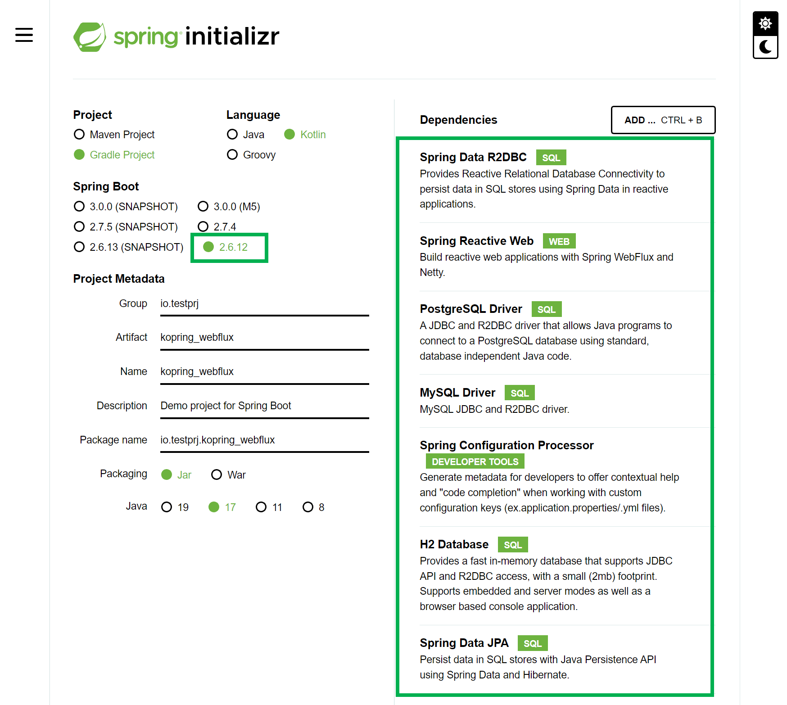
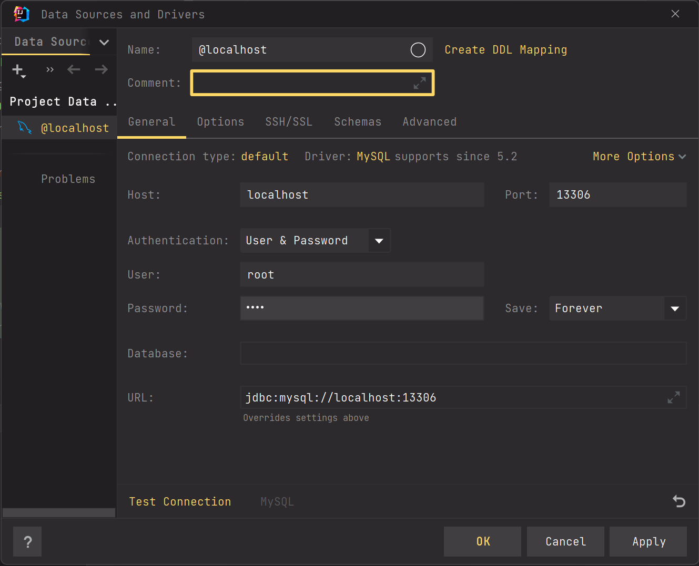
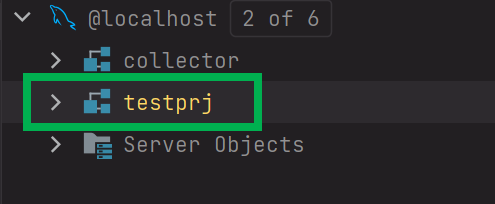
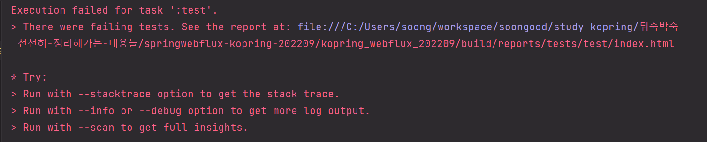
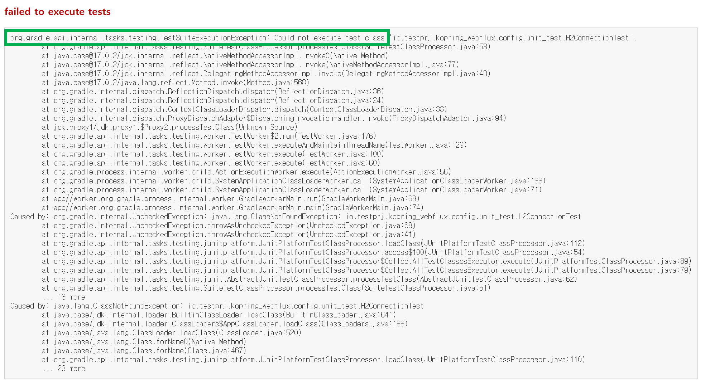
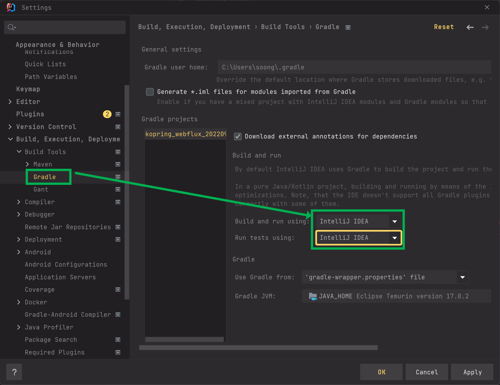

# spring webflux 에서 r2dbc 연동하기 (kotlin 버전)

개인적으로 spring webflux 와 코틀린을 도전적으로 적용해봤었는데, 그냥 세팅과정을 한번 정리해봐야겠다는 생각이 들어서 정리하기 시작했다. 정리 안하면 어차피 또 나중에 허둥댄다. 그래서 정리해두기로 결정 ㅠㅠ<br>

얼른 후딱 정리하고 다른 공부 좀 해야겠다. 코틀린도 정리해야 할 부분이 꽤 있었다ㅋㅋ;;;<br>

코틀린 잘하고 싶음. 써보니 편하고, 좋고, 자꾸 자바방식의 변수선언을 하는 나를 발견하게 됨<br>

<br>

오늘 정리하는 내친 김에 도커이미지로 배포하고 Mysql도 network로 연동하는 과정을 정리해놔야 겠다.<br>

그 다음에 시간나면 Fat Jar 관련해서도 정리해야겠다고 생각이 든다. <br>

이렇게 또 겸사겸사 이렇게 또 연관퀘스트를 만들어내는건가 하는 생각이 들었다....ㅋㅋ<br>

<br>

오늘 잠깐 정리한 것은 R2dbcEntityTemplate, ReactiveCrudRepository 를 사용하는 방식에 대해 정리했다. 처음 r2dbc 계열 라이브러리를 접하면서 혼동스러웠던 부분들도 정리하느라 시간이 조금 걸렸다.<br>

내일 중으로 Controller 측의 코드를 작성한 후에 API 테스트하는 코드를 작성하고, 도커이미지 배포 방식을 정리해볼 예정이다.<BR>

WebFlux 에서도 컨트롤러 어드바이스를 적용할 수 있는데 여기에 대해서는 두번째 문서에서 정리하든가 해야겠다.<br>

<br>

# 프로젝트 다운로드

프로젝트의 기본 의존성은 아래와 같이 지정해줬다.<br>

스프링 부트 버전은 전 버전대에서 가장 안정된 버전인 2.6.12 버전을 선택했다. 이렇게 보수적으로 선언하는 것도 꽤 좋은 선택인것 같다.<br>

> 2022.09.26 현재 2.7.4 버전은 GA 이지만, WEBFLUX 아래에서 R2DBC 를 사용하는 것이 꽤 부자연 스러웠다. 이런 이유로 만들고 있던 토이 프로젝트를 버리고 새로운 프로젝트로 죄다 옮겨서 개발하는 불상사가 일어났었다...<BR>



<br>

Explore 버튼을 눌러서 의존성을 확인해보면 아래와 같이 나타난다.

```groovy
import org.jetbrains.kotlin.gradle.tasks.KotlinCompile

plugins {
	id("org.springframework.boot") version "2.6.12"
	id("io.spring.dependency-management") version "1.0.14.RELEASE"
	kotlin("jvm") version "1.6.21"
	kotlin("plugin.spring") version "1.6.21"
	kotlin("plugin.jpa") version "1.6.21"
}

group = "io.testprj"
version = "0.0.1-SNAPSHOT"
java.sourceCompatibility = JavaVersion.VERSION_17

configurations {
	compileOnly {
		extendsFrom(configurations.annotationProcessor.get())
	}
}

repositories {
	mavenCentral()
}

dependencies {
	implementation("org.springframework.boot:spring-boot-starter-data-jpa")
	implementation("org.springframework.boot:spring-boot-starter-data-r2dbc")
	implementation("org.springframework.boot:spring-boot-starter-webflux")
	implementation("com.fasterxml.jackson.module:jackson-module-kotlin")
	implementation("io.projectreactor.kotlin:reactor-kotlin-extensions")
	implementation("org.jetbrains.kotlin:kotlin-reflect")
	implementation("org.jetbrains.kotlin:kotlin-stdlib-jdk8")
	implementation("org.jetbrains.kotlinx:kotlinx-coroutines-reactor")
	runtimeOnly("com.h2database:h2")
	runtimeOnly("dev.miku:r2dbc-mysql")
	runtimeOnly("io.r2dbc:r2dbc-h2")
	runtimeOnly("io.r2dbc:r2dbc-postgresql")
	runtimeOnly("mysql:mysql-connector-java")
	runtimeOnly("org.postgresql:postgresql")
	annotationProcessor("org.springframework.boot:spring-boot-configuration-processor")
	testImplementation("org.springframework.boot:spring-boot-starter-test")
	testImplementation("io.projectreactor:reactor-test")
}

tasks.withType<KotlinCompile> {
	kotlinOptions {
		freeCompilerArgs = listOf("-Xjsr305=strict")
		jvmTarget = "17"
	}
}

tasks.withType<Test> {
	useJUnitPlatform()
}
```

<br>

# Mysql 세팅

MySQL을 컴퓨터에 설치하기에는 조금 무거우니, 도커로 설치하자. 아래는 도커컴포즈 파일이다.

`docker-compose.yml` 

```yaml
version: '3'
services:
  mysql-for-test:
    image: mysql:8
    restart: always
#    command: --lower_case_table_names=1
    container_name: mysql-test
    ports:
      - "13306:3306"
    environment:
      - MYSQL_USER=collector
      - MYSQL_PASSWORD=1111
      - MYSQL_DATABASE=testprj
      - MYSQL_ROOT_PASSWORD=1111
      - TZ=Asia/Seoul
    command:
      - --character-set-server=utf8mb4
      - --collation-server=utf8mb4_unicode_ci
    volumes:
      - ./init/:/docker-entrypoint-initdb.d/

```

위의 도커 컴포즈 파일을 로컬 PC에서 구동시키려면 아래의 명령어를 터미널에 입력해주자. (윈도우도 가능)

```bash
docker-compose up -d
```

주의할 점은 `docker-compose.yml ` 파일을 만들어둔 폴더 내에서 위의 `docker-compose up -d` 명령어를 실행해야 한다는 점이다.<br>

<br>

위의 설정은 로컬 PC 내의 13306 포트에 mysql 을 실행시킨다.<br>

<br>

intellij 나 datagrip 에서는 아래와 같이 설정해주어서 접속하자.



<br>

testprj 라는 스키마가 생성이 안되어 있다면 직접 생성해주자.



<br>

# spring data r2dbc에 대해 미리 알아둬야 할 점...

**개발 용도로 테이블 자동 생성이 안된다.**<br>

- 애초에 spring.jpa.hibernate.ddl-auto=create, create-drop, update 는 개발 용도의 편리성이었다. 
- 운영용도로 사용하기엔 좋은 것은 아니었다.

JPA 개발을 하면서 많은 분들이 아마도  `spring.jpa.hibernate.ddl-auto=create-drop` 속성을 주어서  개발 PC내에서 빠르게 결과를 확인해보고 토이프로젝트를 만들어본 들이 꽤 많지 않았을까 싶다.<br>

하지만 r2dbc에서는 이렇게 초기에 `spring.jpa.hibernate.ddl-auto` 를 지정하는 것으로 스키마가 생성이 안된다. `spring.jpa` 로 시작하는 패키지가 아니라는 것만 보면 알수 있다.<br>

jpa 이전에는 mybatis 로 개발할때는 원래 schema 직접 생성하고 했었으니, sql 정도는 직접 작성하는게 더 나을지도 모르겠다. 개발PC에  테스트 용도 외에는 테이블 자동생성 기능은 사실 운영에서 그대로 사용하기는 위험하다. 그래서 그리 단점은 아니라고 생각하는게 나을것 같다.<br>

<br>

**더티체킹, 연관관계 매핑을 지원하지 않는다.**<br>

조인을 사용하려면 raw sql을 사용하면 된다. raw sql 은 R2DBCEntityTemplate 을 사용하면 가능하다.<br>

더티체킹은 지원되지 않기에 한결 더 불변성에 가깝다는 사실은 장점이다.<br>

아직은 트랜잭션 처리까지는 안해봤는데, 이건 테스트 코드를 만들어봐야겠다.<br>

<br>

**테스트 데이터 멱등성**<br>

주의할 점은 이렇다. r2dbc 테스트 시에는 테스트한 모든 데이터가 삭제된다. 그래서 내가 이걸 했었는데, 개발용 DB에 반영이 안됐네? 하는 생각이 들 수 있다. 바로 내가 처음에 접했을 때 그랬다. JPA 관련해서 @Transactional 관련 테스트 코드를 작성했을 때도 비슷한 현상이 있었는데, 이것은 테스트 시에 데이터를 검증하고 데이터 찌꺼기를 물리적인 DB에 남겨두면 안되기에 테스트 종료시에 잔여 데이터들을 롤백해두는 동작으로 인해 발생하는 현상으로 보인다. 테스트에는 멱등성이라는 원칙이 중요하기 때문이다. <br>

JPA 트랜잭셔널 공부할 때 당해놓고 r2dbc 공부할 때 또 한번 당했다 ㅋㅋㅋ<br>

<br>

# mysql 테이블 생성

```sql
-- DROP TABLE IF EXISTS payment;
CREATE SCHEMA IF NOT EXISTS testprj;
DROP TABLE IF EXISTS testprj.book;
--
-- -- CREATE TABLE payment
create table testprj.book
(
    book_id    bigint auto_increment
        primary key,
    name        varchar(30)      null,
    price        bigint      null
);

commit;
```

<br>

# R2dbc 설정

설정은 아래와 같이 해줬다. 자세한 내용은 주석을 보자. 설명을 적는게 지금은 시간이 좀 많이 걸려서 설명 적는 것은 패스<br>

명심하자...지금 나는 코틀린 코드를 정리하고 있다.<br>

나중에 다시 보면서 세미콜론이 왜 없지? 하고 헷갈리면 안된다.<br>

```kotlin
package io.testprj.kopring_webflux.config

import io.r2dbc.spi.ConnectionFactory
import org.springframework.context.annotation.Bean
import org.springframework.context.annotation.ComponentScan
import org.springframework.context.annotation.Configuration
import org.springframework.context.annotation.FilterType
import org.springframework.core.io.ClassPathResource
import org.springframework.data.r2dbc.config.EnableR2dbcAuditing
import org.springframework.data.r2dbc.repository.config.EnableR2dbcRepositories
import org.springframework.r2dbc.connection.init.ConnectionFactoryInitializer
import org.springframework.r2dbc.connection.init.ResourceDatabasePopulator

@Configuration
@EnableR2dbcRepositories(
    basePackages = [
        // 상위 패키지는 io.testprj.kopring_webflux
        "io.testprj.kopring_webflux"
    ],
    includeFilters = [
        // 엔티티 스캔은 io.testprj.kopring_webflux 밑의 모든 repository 라는 패키지
        // 그 밑에 Repository 라는 파일명으로 끝나는 모든 클래스들
        ComponentScan.Filter(
            type = FilterType.REGEX,
            pattern = ["io.testprj.kopring_webflux.*.repository.*Repository"]
        )
    ]
)
@EnableR2dbcAuditing
class R2DBCConfig {

    // init sql 실행을 위한 코드..
    @Bean
    fun init(connectionFactory: ConnectionFactory) =
        ConnectionFactoryInitializer().apply{
            setConnectionFactory(connectionFactory)
            setDatabasePopulator(
                ResourceDatabasePopulator(
                    // src/main/resources 아래에 mysql-schema.sql 을 두자...
                    ClassPathResource("mysql-schema.sql")
                )
            )
        }
}
```

<br>

# r2dbc 처음 세팅시 에러 발생할 경우 해결책

에러 문구가 아래와 같이 나타난다. 



<br>

아래에서 안내해주는 index.html 을 찾아가보자.

찾아가서 열어보면 아래와 같은 내용이 나온다.



에러 문구는 아래와 같다.

```
org.gradle.api.internal.tasks.testing.TestSuiteExecutionException: Could not execute test class 'io.testprj.kopring_webflux.config.unit_test.H2ConnectionTest'
```

<br>

이것은... Build Tool 을 Gradle 로 설정했을 경우에 나타나는 에러다. Build Tool 을 Intellij 로 설정해주자.




# Entity, Repository 코드 작성

사실 r2dbc 에는 entity 라는 개념이 없는 것으로 보인다. 대신 `@Table` 이라는 개념을 사용한다.<br>

package 경로는 `org.springframework.data.relational.core.mapping.Table` 이다.<br>

주로 아래의 패키지 경로들을 사용하는 편이다.<br>

- org.springframework.data.relational.core.mapping
- org.springframework.data.annotation

<br>

## Book 클래스 - Entity (테이블 매핑)

Entity 코드다. 이번 문서에서만 Entity 코드라고 부르기로 했다.

정리할 내용이 많아서 이번에는 설명을 정리하지 않고 코드만 정리해두기로 했다.

```kotlin
package io.testprj.kopring_webflux.book.entity

import org.springframework.data.annotation.Id
import org.springframework.data.relational.core.mapping.Column
import org.springframework.data.relational.core.mapping.Table
import java.math.BigDecimal

@Table
data class Book (
    @Id
    val id : Long?,
    @Column
    val name : String,
    @Column
    val price : BigDecimal
){
}
```

<br>

## BookRepository

기본으로 사용되는 `ReactiveCrudRepository` 를 사용하기로 했다.<br>

이번에도 역시 설명은 생략하기로 했다.<br>

```kotlin
package io.testprj.kopring_webflux.book.repository

import io.testprj.kopring_webflux.book.entity.Book
import org.springframework.data.repository.reactive.ReactiveCrudRepository

interface BookRepository : ReactiveCrudRepository<Book, Long> {
}
```

<br>

# BookEntityTemplate

## (raw sql) create table sql 

R2dbcEntityTemplate 을 이용하는 예제를 작성해보자. 

먼저 https://www.dpriver.com/pp/sqlformat.htm 에서 아래의 sql 을 StringBuffer 기반의 코드로 변환해준다.

```sql
create table testprj.book
(
    book_id    bigint auto_increment
        primary key,
    name        varchar(30)      null,
    price        bigint      null
);
```

<br>

변환한 코드를 IDE 에 옮기면, CONVERT CODE FROM JAVA 라는 알림창이 나타나는데 그냥 Yes 를 눌러주면 아래와 같이 코틀린 코드로 변환된다.

```kotlin
val builder = StringBuilder()
builder.append("create table testprj.book ")
builder.append("( ")
builder.append("    book_id     bigint auto_increment ")
builder.append("        primary key, ")
builder.append("    name        varchar(30)      null, ")
builder.append("    price        bigint          null ")
builder.append(")")
```

<br>

이제 이 코드를 기반으로 CREATE SQL 을 생성해보자. R2cbcEntityTemplate 클래스에 아래와 같은 함수를 정의해주자.

테이블을 생성하는 SQL이다.<br>
ConnectionFactory 를 경우에 따라 선택해서 입력해주면 테스트시에 정말 편하기에, ConnectionFactory도 별도로 생성자주입받도록 지정해줬다<br>

```kotlin
@Component
class BookEntityTemplate (
    val connectionFactory: ConnectionFactory,
    val r2dbcEntityTemplate: R2dbcEntityTemplate = R2dbcEntityTemplate(connectionFactory)
){
    // ...
    
	fun createBookTable() : Mono<Int>{
        val builder = StringBuilder()
        builder.append("create table testprj.book ")
        builder.append("( ")
        builder.append("    book_id    bigint auto_increment ")
        builder.append("        primary key, ")
        builder.append("    name        varchar(30)      null, ")
        builder.append("    price        bigint      null ")
        builder.append(")")

        return r2dbcEntityTemplate.databaseClient
            .sql(
                builder.toString()
            )
            .fetch()
            .rowsUpdated()
    }
    
    // ...
    
}
```

<br>

## (raw sql) drop table sql

이번에는 테이블을 drop 하는 SQL 을 연습해보자.<br>

아까와 마찬가지로 Book 테이블을 사용할 것이기에 BookEntityTemplate 을 사용한다.<br>

BookEntityTemplate은 테스트 코드에서 ConnectionFactory를 종류별로 바꿔가면서 사용할 수 있도록 생성자에 ConnectionFactory를 지정해준다.<br>

먼저 drop 테이블 sql 은 아래와 같다.<br>

```sql
DROP TABLE IF EXISTS testprj.book;
```

<br>

그리고 이것은 아래와 같이 BookEntityTemplate 에 구현해줬다.<br>

```kotlin
@Component
class BookEntityTemplate (
    val connectionFactory: ConnectionFactory,
    val r2dbcEntityTemplate: R2dbcEntityTemplate = R2dbcEntityTemplate(connectionFactory)
){
    
    // ...
    
    fun dropBookTable(): Mono<Int> {
        val builder = StringBuilder()
        builder.append("DROP TABLE IF EXISTS testprj.book")

        return r2dbcEntityTemplate.databaseClient
            .sql(builder.toString())
            .fetch()
            .rowsUpdated()
    }
    
    // ... 
    
}
```

<br>

이제 이 두 코드들을 테스트해보자.<br>

<br>

## drop table -> create table 테스트

주의할 점은 이렇다. r2dbc 테스트 시에는 테스트한 모든 데이터가 삭제된다. 그래서 내가 이걸 했었는데, 개발용 DB에 반영이 안됐네? 하는 생각이 들 수 있다. 바로 내가 처음에 접했을 때 그랬다. JPA 관련해서 @Transactional 관련 테스트 코드를 작성했을 때도 비슷한 현상이 있었는데, 이것은 테스트 시에 데이터를 검증하고 데이터 찌꺼기를 물리적인 DB에 남겨두면 안되기에 테스트 종료시에 잔여 데이터들을 롤백해두는 동작으로 인해 발생하는 현상으로 보인다. 테스트에는 멱등성이라는 원칙이 중요하기 때문이다. <br>

JPA 트랜잭셔널 공부할 때 당해놓고 r2dbc 공부할 때 또 한번 당했다 ㅋㅋㅋ<br>

예제에 대해 간단하게 설명을 적어보면 이렇다. <br>

- BookEntityTemplate 을 이용해서 book 테이블을 삭제한다.
  - 이 동작이 제대로 수행됐는지 StepVerifier 를 통해서 검증한다.
- BookEntityTemplate 을 이용해서 book 테이블을 생성한다.
  - 이 동작이 제대로 수행됐는지 StepVerifier 를 통해서 검증한다.

<br>

```kotlin
@SpringBootTest
class H2ConnectionTest {

    // ...
    
    @Autowired
    lateinit var connectionFactory: ConnectionFactory

    @Test
    fun `h2 BookEntityTemplate Drop Table SQL 테스트`(){
        val bookEntityTemplate : BookEntityTemplate = BookEntityTemplate(connectionFactory)

        StepVerifier.create(bookEntityTemplate.dropBookTable())
            .expectNextCount(1)
            .verifyComplete()

        StepVerifier.create(bookEntityTemplate.createBookTable())
            .expectNextCount(1)
            .verifyComplete()
    }
    
    // ...
    
}
```

<br>

# 순수 R2DBCEntityTemplate SQL 테스트(스프링 도움없이)

이번에는 스프링의 도움을 받지않고 순수 R2DbcTemplate 만을 이용해서 테스트를 해보려 한다.

일단 시간이 없어서 소스코드만 남겼다.

```kotlin
@Test
fun `h2 테이블 드랍 후 테이블 CREATE 테스트`(){
    val connectionFactory: ConnectionFactory =
    ConnectionFactories.get("r2dbc:h2:mem:///sa::testdb?options=DB_CLOSE_DELAY=-1;DB_CLOSE_ON_EXIT=FALSE")

    val template = R2dbcEntityTemplate(connectionFactory)

    val builder1 = StringBuilder()
    builder1.append("DROP TABLE IF EXISTS book")


    val res1 : Mono<Int> = template.databaseClient
    .sql(builder1.toString())
    .fetch()
    .rowsUpdated()

    StepVerifier.create(res1)
    .expectNextCount(1)
    .verifyComplete()

    val builder = StringBuilder()
    builder.append("create table book ")
    builder.append("( ")
    builder.append("    book_id    bigint auto_increment ")
    builder.append("        primary key, ")
    builder.append("    name        varchar(30)      null, ")
    builder.append("    price        bigint      null ")
    builder.append(")")

    val res2 : Mono<Int> = template.databaseClient
    .sql(
        builder.toString()
    )
    .fetch()
    .rowsUpdated()

    StepVerifier.create(res2)
    .expectNextCount(1)
    .verifyComplete()
}
```

<br>

# Controller

